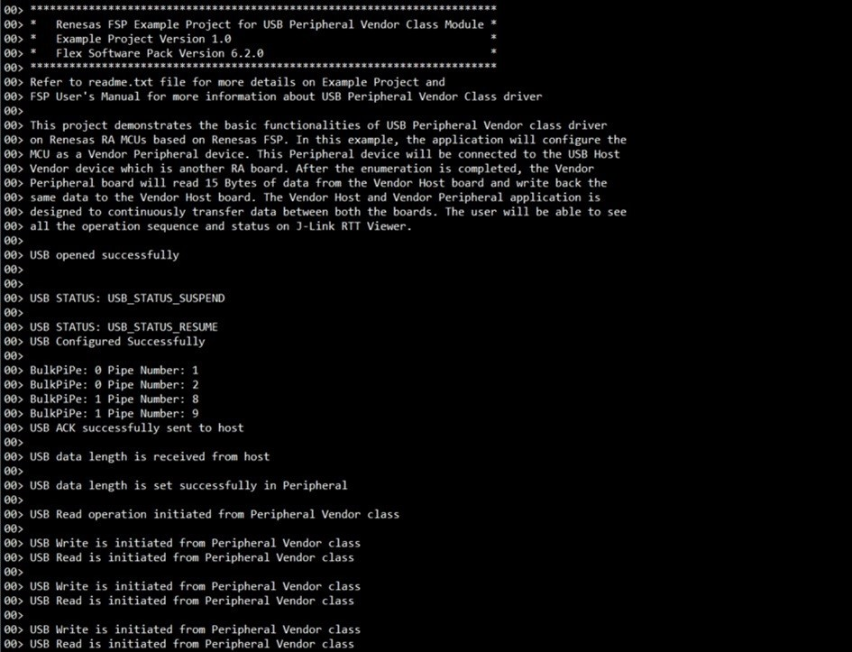

# Introduction #
This project demonstrates the basic functionalities of USB Peripheral Vendor (USB PVND) class driver on Renesas RA MCUs based on Renesas FSP. In this example, the application will configure the MCU as a Vendor Peripheral device. This Peripheral device will be connected to the USB Host Vendor (USB HVND) device which is another RA board. After the enumeration is completed, the Vendor Peripheral board will read 15 Bytes of data from the Vendor Host board and write back the same data to the Vendor Host board. The Vendor Host and Vendor Peripheral applications are designed to continuously transfer data between both the boards. User will be able to see all the operation sequence and status on J-Link RTT Viewer.

Please refer to the [Example Project Usage Guide](https://github.com/renesas/ra-fsp-examples/blob/master/example_projects/Example%20Project%20Usage%20Guide.pdf) for general information on example projects and [readme.txt](./readme.txt) for specifics of operation.

## Required Resources ##
To build and run the usb peripheral vendor example project, the following resources are needed.

### Hardware ###
* Supported RA boards: EK-RA2A1, EK-RA4M1, EK-RA4M2, EK-RA4M3, EK-RA6M1, EK-RA6M2, EK-RA6M3, EK-RA6M3G, EK-RA6M4, EK-RA6M5.

* 2 x Supported RA boards:
    * 1 x RA board (e.g., EK-RA4M1) runs the USB PVND example project.
	* 1 x RA board (e.g., EK-RA4M2) runs the USB HVND example project.
* 1 x USB OTG cable.
* 3 x USB cables.
    * 2 x USB cables for programming and debugging.
    * 1 x USB cable used to connect the RA board 1 to the RA board 2 through the USB OTG cable.

* Supported USB modes (PVND/HVND) depend on the specific board, as shown in the table below:

    | Board     | USB PVND    | USB HVND    |
    | :-------: | :---------: | :---------: | 
    | EK-RA2A1  | Support     | Not support |
    | EK-RA4M1  | Support     | Not support |
    | EK-RA4M2  | Support     | Support     |
    | EK-RA4M3  | Support     | Support     |
    | EK-RA6M1  | Support     | Not support |
    | EK-RA6M2  | Support     | Not support |
    | EK-RA6M3  | Support     | Support     |
    | EK-RA6M3G | Support     | Support     |
    | EK-RA6M4  | Support     | Support     |
    | EK-RA6M5  | Support     | Support     |

### Hardware Connections ###
* Connect RA board 1 running the USB PVND example project to RA board 2 running the USB HVND example project using a USB OTG cable.
* Connect USB debug ports of the two RA boards to USB ports of the host PC using two USB cables.
* For EK-RA2A1, EK-RA4M1, EK-RA6M1, EK-RA6M2 (Full-Speed):
    * Connect micro-AB USB Full-Speed port (J9) of the Board1 to Board2 via a micro USB cable through a USB OTG cable.

* For EK-RA4M2, EK-RA4M3, EK-RA6M4, EK-RA6M5 (Full-Speed):
    * Jumper J12 placement is pins 2-3.
    * Connect jumper J15 pins.
    * Connect micro-AB USB Full-Speed port (J11) of the Board1 to Board2 via a micro USB cable through a USB OTG cable.

* For EK-RA6M3, EK-RA6M3G (High-Speed):
    * Jumper J7 placement is pins 2-3.
    * Connect jumper J17 pins.
    * Connect micro-AB USB High-Speed port (J6) of the Board1 to Board2 via a micro USB cable through OTG cable.

### Software ###
Refer to software described in [Example Project Usage Guide](https://github.com/renesas/ra-fsp-examples/blob/master/example_projects/Example%20Project%20Usage%20Guide.pdf)

## Related Collateral References ##
The following documents can be referred to for enhancing your understanding of the operation of this example project:
- [FSP User Manual on GitHub](https://renesas.github.io/fsp/)
- [FSP Known Issues](https://github.com/renesas/fsp/issues)

# Project Notes #

## System Level Block Diagram ##

The image shows an example of two connected RA boards, for example with EK-RA4M1 running the USB PVND example and EK-RA4M2 running the USB HVND example.

## FSP Modules Used ##
List all the various modules that are used in this example project. Refer to the FSP User Manual for further details on each module listed below.

| Module Name | Usage  | Searchable Keyword (using New Stack > Search) |
|-------------|-----------------------------------------------|-----------------------------------------------|
| USB Peripheral Vendor |USB Peripheral Vendor class works by combining r_usb_basic module. | USB pvnd |

## Module Configuration Notes ##
This section describes FSP Configurator properties which are important or different than those selected by default. 

|   Module Property Path and Identifier   |   Default Value   |   Used Value   |   Reason   |
| :-------------------------------------: | :---------------: | :------------: | :--------: |
|   configuration.xml -> g_basic USB Driver on R_USB_Basic > Settings > Property > Module g_basic USB Driver on R_USB_Basic > USB RTOS Callback  |   NULL   |   usb_peri_vendor_callback   |   As RTOS is used, so the callback function is set and this callback function will notify user about occurrence of usb events.   |
|   configuration.xml -> g_basic USB Driver on R_USB_Basic > Settings > Property > Module g_basic USB Driver on R_USB_Basic > USB Speed  |   Full Speed   |   Hi Speed   |   This is changed to showcase Hi Speed functionality. Applicable only for EK_RA6M3/G board.   |
|   configuration.xml -> g_basic USB Driver on R_USB_Basic > Settings > Property > Module g_basic USB Driver on R_USB_Basic > USB Module Number  |   USB_IP0   |   USB_IP1   |   This is changed to USB_IP1,when USB Hi Speed is selected for EK_RA6M3/G board.   |
|   configuration.xml -> Peri Thread > Settings > Property > Thread > Stack Size  |   1024   |   4096   |   This is changed to handle its worst-case function call nesting and local variable usage.   |
|   configuration.xml -> Peri Thread > Settings > Property > Thread > Dynamic Allocation support  |   Disabled   |   Enabled   |   RTOS objects can be created using RAM that is automatically allocated from the FreeRTOS heap.   |
|   configuration.xml -> Peri Thread > Settings > Property > Common > Total Heap Size  |   0   |   19000   |   This is changed because Dynamic Allocation support is enabled, so application makes use of amount of RAM available in the FreeRTOS heap.   |
|   configuration.xml -> Peri Thread > Settings > Property > Common > Memory Allocation  |   static   |   Dynamic   |   This is changed to allocate memory for this object from a FreeRTOS heap.   |
|   configuration.xml -> g_queue Queue > Settings > Property > Queue Memory Allocation |   static   |   Dynamic   | This is changed to allocate memory for this object from a FreeRTOS heap.   |
|   configuration.xml -> g_queue Queue > Settings > Property > Queue Length |  20   |   10   | Queue length is assigned. |

## API Usage ##

The table below lists the FSP provided API used at the application layer by this example project.

| API Name    | Usage                                                                          |
|-------------|--------------------------------------------------------------------------------|
|R_USB_PipeRead | This API is used to Read data from host, when USB Write complete event occur. |
|R_USB_PipeWrite| This API is used to Write data back to host, when USB READ complete event occur.|
|R_USB_PeriControlDataGet| This API is used to get data length from host.|
|R_USB_PeriControlDataSet| This API is used to set data length in peripheral.|
|R_USB_PeriControlStatusSet| This API is used to set the USB status as ACK response.|

## Verifying operation ##
1. Import, generate, and build the [USB PVND example project](https://github.com/renesas/ra-fsp-examples/tree/master/example_projects/ek_ra4m1/usb_pvnd/usb_pvnd_ek_ra4m1_ep). Flash the project to the supported RA board 1 (e.g., EK-RA4M1).
2. Import, generate, and build the [USB HVND example project](https://github.com/renesas/ra-fsp-examples/tree/master/example_projects/ek_ra4m2/usb_hvnd/usb_hvnd_ek_ra4m2_ep). Flash the project to the supported RA board 2 (e.g., EK-RA4M2).
3. Before running the example project, make sure the [hardware connections](#hardware-connections) are completed.
4. Open J-Link RTT Viewer to see the output.
    * The output on J-Link RTT Viewer for USB PVND:

        

## Special Topics ##

### Developing Descriptor ###
Refer **Descriptor** section of [usb_peripheral_vendor_descriptor](https://renesas.github.io/fsp/group___u_s_b___p_v_n_d.html) for developing a descriptor.
The template file provided can be placed in the src folder after removing the .template file extension.
