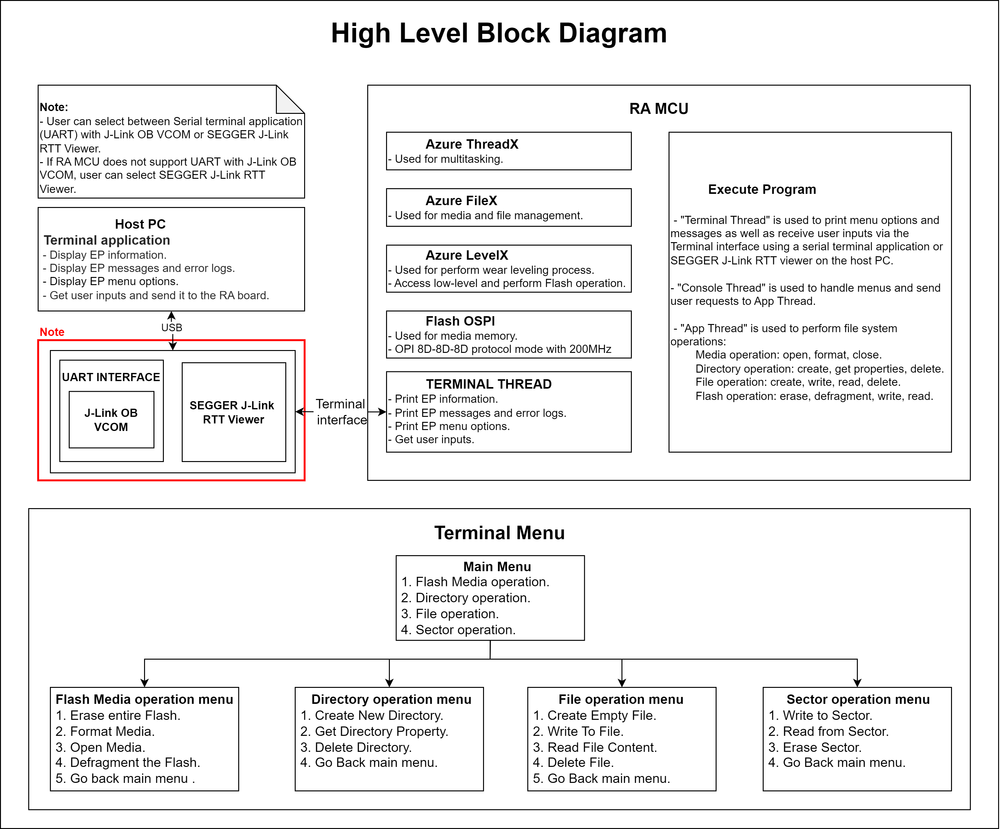
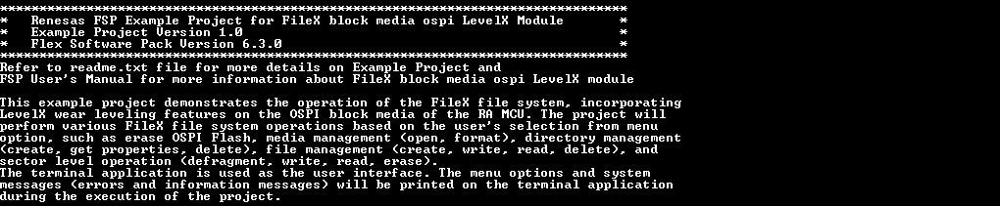
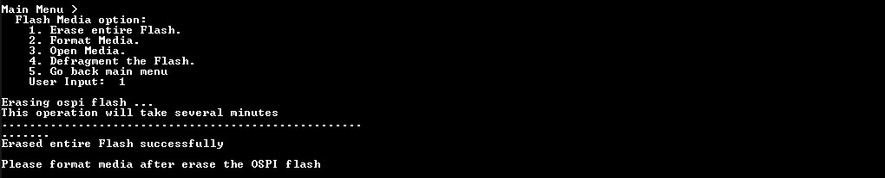
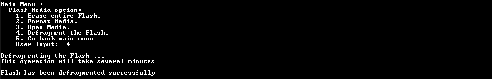
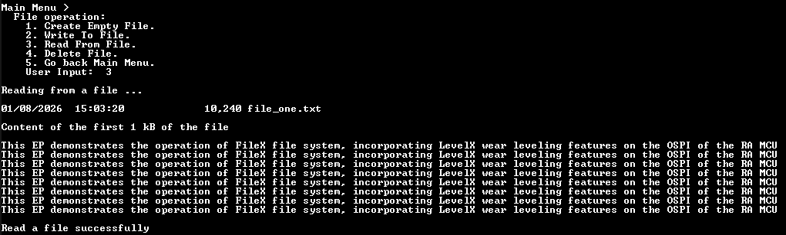

# Introduction #

This example project demonstrates the operation of the FileX file system, incorporating LevelX wear leveling features on the OSPI block media of the RA MCU. The project will perform various FileX file system operations based on the user's selection from the menu option, such as erase OSPI Flash, media management (open, format), directory management (create, get properties, delete), file management (create, write, read, delete), and sector level operation (defragment, write, read, erase). The terminal application is used as the user interface. The menu options and system messages (errors and information messages) will be printed on the terminal application during the execution of the project.

**Note:**
- To display information, users can choose between the SEGGER J-Link RTT Viewer and the serial terminal (UART)with J-Link OB VCOM. It is important to note that the user should only operate a single terminal application at a time to avoid conflicts or data inconsistencies.
- For instructions on how to switch between these options, please refer to the **[Verifying Operation](#verifying-operation)** section in this file.
- By default, EP information is printed to the host PC using the serial terminal for boards that support J-Link OB VCOM. Vice versa, for the RA boards that do not support J-Link OB VCOM, EP uses the SEGGER J-Link RTT Viewer by default instead.
- RA boards supported for J-Link OB VCOM: EK-RA8D1, EK-RA8M2.

In Main menu, based on the input, user selects sub menu such as media menu, directory menu, file menu, or sector.
1. Flash Media operation menu.
2. Directory operation menu.
3. File operation menu.
4. Sector operation menu.

In Flash Media menu, based on the input, user selects operations to perform.
1. Erase entire Flash.
2. Format Media.
3. Open Media.
4. Defragment the Flash.
5. Go back Main Menu.

In Directory menu, based on the input, user selects operations to perform.
1. Create Directory.
2. Get Directory properties.
3. Delete Directory.
5. Go back Main Menu.

In File menu, based on the input, user selects operations to perform.
1. Create Empty File.
2. Write To File.
3. Read From File.
3. Delete File.
5. Go back Main Menu.

In Sector menu, based on the input, user selects operations to perform.
1. Write to Sector.
2. Read from Sector.
3. Erase Sector.
4. Go back Main Menu.

Please refer to the [Example Project Usage Guide](https://github.com/renesas/ra-fsp-examples/blob/master/example_projects/Example%20Project%20Usage%20Guide.pdf) for general information on example projects and [readme.txt](./readme.txt) for specifics of operation.

### Software ###
* Renesas Flexible Software Package (FSP): Version 6.4.0
* E2 studio: Version 2025-12
* SEGGER J-Link RTT Viewer: Version 9.14a
* LLVM Embedded Toolchain for ARM: Version 21.1.1
* Terminal Console Application: Tera Term or a similar application

## Required Resources ##
The following resources are needed to build and run the FileX_block_media_ospi_LevelX example project.

### Hardware ###
Supported RA boards: EK-RA8D1, EK-RA8M2
* 1 x Renesas RA board.
* 1 x USB cable for programming and debugging

### Hardware Connections ###
* Connect the USB Debug port on the RA board to the host PC via a USB cable.
* For EK-RA8M2: The user must place jumper J6 on pins 2-3, J8 on pins 1-2, J9 on pins 2-3, and J29 on pins 1-2, 3-4, 5-6, 7-8 to use the on-board debug functionality.

Refer to the software required section in [Example Project Usage Guide](https://github.com/renesas/ra-fsp-examples/blob/master/example_projects/Example%20Project%20Usage%20Guide.pdf)

## Related Collateral References ##
The following documents can be referred to for enhancing your understanding of the operation of this example project:
- [FSP User Manual on GitHub](https://renesas.github.io/fsp/)
- [FSP Known Issues](https://github.com/renesas/fsp/issues)

# Project Notes #

## System Level Block Diagram ##
 High level block diagram of the system is as shown below:
 

## FSP Modules Used ##
List all the various modules that are used in this example project. Refer to the FSP User Manual for further details on each module listed below.

| Module Name | Usage | Searchable Keyword  |
|-------------|-----------------------------------------------|-----------------------------------------------|
| Azure RTOS FileX on LevelX NOR | Azure RTOS FileX on LevelX NOR is used to configure the FileX system and media properties. | FileX |
| LevelX NOR Port | This module provides the hardware port layer for LevelX on NOR SPI flash memory. | rm_levelx_nor_spi |
| OSPI Flash | OSPI_B is used to configure flash device and perform write, read, or erase operations on flash device's memory array. | r_ospi_b |

## Module Configuration Notes ##
This section describes FSP configuration properties that are important or different from those selected by default.

**Configuration Properties for using Azure RTOS FileX on LevelX NOR**

|   Module Property Path and Identifier   |   Default Value   |   Used Value   |   Reason   |
|-----------------------------------------|-------------------|----------------|------------|
| configuration.xml > Stacks > Threads > App Thread > App Thread Stacks > g_fx_media Azure RTOS FileX on LevelX NOR > Properties > Settings > Property > Module g_fx_media Azure RTOS FileX on LevelX NOR > Volume Name | Volume 1 | RA OSPI_B | Set the volume label for the media. |
| configuration.xml > Stacks > Threads > App Thread > App Thread Stacks > g_fx_media Azure RTOS FileX on LevelX NOR > Properties > Settings > Property > Module g_fx_media Azure RTOS FileX on LevelX NOR > Number of FATs | 1 | 1 | Set the number of FATs in the media to 1. |
| configuration.xml > Stacks > Threads > App Thread > App Thread Stacks > g_fx_media Azure RTOS FileX on LevelX NOR > Properties > Settings > Property > Module g_fx_media Azure RTOS FileX on LevelX NOR > Directory Entries | 256 | 256 | Set the number of directory entries in the root directory. |
| configuration.xml > Stacks > Threads > App Thread > App Thread Stacks > g_fx_media Azure RTOS FileX on LevelX NOR > Properties > Settings > Property > Module g_fx_media Azure RTOS FileX on LevelX NOR > Hidden Sectors | 0 | 0 | set the number of sectors hidden. |
| configuration.xml > Stacks > Threads > App Thread > App Thread Stacks > g_fx_media Azure RTOS FileX on LevelX NOR > Properties > Settings > Property > Module g_fx_media Azure RTOS FileX on LevelX NOR > Total Sectors | 65536 | 66336 | Set the total number of sectors in the media. |
| configuration.xml > Stacks > Threads > App Thread > App Thread Stacks > g_fx_media Azure RTOS FileX on LevelX NOR > Properties > Settings > Property > Module g_fx_media Azure RTOS FileX on LevelX NOR > Sectors per Cluster | 1 | 1 | Set the number of sectors in each cluster. |
| configuration.xml > Stacks > Threads > App Thread > App Thread Stacks > g_fx_media Azure RTOS FileX on LevelX NOR > Properties > Settings > Property > Module g_fx_media Azure RTOS FileX on LevelX NOR > Working media memory size | 512 | 512 | Set the memory allocated for the file system. |

**Configuration Properties for using LevelX NOR Port**

|   Module Property Path and Identifier   |   Default Value   |   Used Value   |   Reason   |
|-----------------------------------------|-------------------|----------------|------------|
| configuration.xml > Stacks > Threads > App Thread > App Thread Stacks > g_rm_levelx_nor_spi LevelX NOR Port (rm_levelx_nor_spi) > Properties > Settings > Property > Common > Page Buffer Size (bytes) | 256 | 64 | Select the memory storage size for the block media. |
| configuration.xml > Stacks > Threads > App Thread > App Thread Stacks > g_rm_levelx_nor_spi LevelX NOR Port (rm_levelx_nor_spi) > Properties > Settings > Property > Module g_rm_levelx_nor_spi LevelX NOR Port (rm_levelx_nor_spi) > Memory Start Address Offset (bytes) | 0 | 0x1000 | Select the starting offset to use in the SPI memory. |
| configuration.xml > Stacks > Threads > App Thread > App Thread Stacks > g_rm_levelx_nor_spi LevelX NOR Port (rm_levelx_nor_spi) > Properties > Settings > Property > Module g_rm_levelx_nor_spi LevelX NOR Port (rm_levelx_nor_spi) > Memory Size (bytes) | 33554432 | 33964032 | Select the size of the LevelX memory that is sufficient to use the FAT32 format. |
| configuration.xml > Stacks > Threads > App Thread > App Thread Stacks > g_rm_levelx_nor_spi LevelX NOR Port (rm_levelx_nor_spi) > Properties > Settings > Property > Module g_rm_levelx_nor_spi LevelX NOR Port (rm_levelx_nor_spi) > Poll Status Count | 0xFFFFFFFF | 0xFFFFFFFF | Number of times to poll for operation complete status for blocking memory operations. |

**Configuration Properties for using OSPI Flash (For FileX Instance)**

|   Module Property Path and Identifier   |   Default Value   |   Used Value   |   Reason   |
|-----------------------------------------|-------------------|----------------|------------|
| configuration.xml > Stacks > g_ospi_b_filex OSPI Flash (r_ospi_b) > Properties > Settings > Property > Common > DMAC Support | Disable | Enable | Enable DMAC support for the OSPI module. |
| configuration.xml > Stacks > g_ospi_b_filex OSPI Flash (r_ospi_b) > Properties > Settings > Property > Common > Autocalibration Support | Disable | Enable | Enable DS autocalibration for dual-data-rate modes. |
| configuration.xml > Stacks > g_ospi_b_filex OSPI Flash (r_ospi_b) > Properties > Settings > Property > Module g_ospi_b_filex OSPI Flash (r_ospi_b) > General > Name | g_ospi | g_ospi_b_filex | Module name. |
| configuration.xml > Stacks > g_ospi_b_filex OSPI Flash (r_ospi_b) > Properties > Settings > Property > Module g_ospi_b_filex OSPI Flash (r_ospi_b) > General > Unit | OSPI_B0 | OSPI_B0 | Specify the OSPI peripheral to use. |
| configuration.xml > Stacks > g_ospi_b_filex OSPI Flash (r_ospi_b) > Properties > Settings > Property > Module g_ospi_b_filex OSPI Flash (r_ospi_b) > General > Chip Select | CS1 | CS1 | Specify the OSPI chip select line to use. |
| configuration.xml > Stacks > g_ospi_b_filex OSPI Flash (r_ospi_b) > Properties > Settings > Property > Module g_ospi_b_filex OSPI Flash (r_ospi_b) > General > Write Status Bit | b0 | b0 | Position of the status bit in the flash device register. |
| configuration.xml > Stacks > g_ospi_b_filex OSPI Flash (r_ospi_b) > Properties > Settings > Property > Module g_ospi_b_filex OSPI Flash (r_ospi_b) > General > Write Enable Bit | b1 | b1 | Position of the write enable bit in the flash device register. |
| configuration.xml > Stacks > g_ospi_b_filex OSPI Flash (r_ospi_b) > Properties > Settings > Property > Module g_ospi_b_filex OSPI Flash (r_ospi_b) > General > DS Auto-calibration Pattern Address | 0 | 0x90000000 | Address to the auto-calibration pattern in the target flash memory's address space. |
| configuration.xml > Stacks > g_ospi_b_filex OSPI Flash (r_ospi_b) > Properties > Settings > Property > Module g_ospi_b_filex OSPI Flash (r_ospi_b) > Command Sets > Erase Sizes > Sector Erase | 4096 | 4096 | Size of memory region erased by Sector Erase. |
| configuration.xml > Stacks > g_ospi_b_filex OSPI Flash (r_ospi_b) > Properties > Settings > Property > Module g_ospi_b_filex OSPI Flash (r_ospi_b) > Command Sets > Erase Sizes > Block Erase | 262144 | 65536 | Size of memory region erased by Block Erase. |
| configuration.xml > Stacks > g_ospi_b_filex OSPI Flash (r_ospi_b) > Properties > Settings > Property > Module g_ospi_b_filex OSPI Flash (r_ospi_b) > Command Sets > Initial Mode > Protocol Mode | SPI (1S-1S-1S) | Dual data rate OPI (8D-8D-8D) | Select Dual data rate OPI (8D-8D-8D) as the initial protocol mode. |
| configuration.xml > Stacks > g_ospi_b_filex OSPI Flash (r_ospi_b) > Properties > Settings > Property > Module g_ospi_b_filex OSPI Flash (r_ospi_b) > Command Sets > Initial Mode > Frame Format | Standard | xSPI Profile 1.0 | Select the frame format to use with this command set. |
| configuration.xml > Stacks > g_ospi_b_filex OSPI Flash (r_ospi_b) > Properties > Settings > Property > Module g_ospi_b_filex OSPI Flash (r_ospi_b) > Command Sets > Initial Mode > Address Length | 3 bytes | 4 bytes | Select number of bytes used to address data in a memory page or row. |
| configuration.xml > Stacks > g_ospi_b_filex OSPI Flash (r_ospi_b) > Properties > Settings > Property > Module g_ospi_b_filex OSPI Flash (r_ospi_b) > Command Sets > Initial Mode > Command Code Length | 1 byte | 2 bytes | Select number of bytes used for command codes. |
| configuration.xml > Stacks > g_ospi_b_filex OSPI Flash (r_ospi_b) > Properties > Settings > Property > Module g_ospi_b_filex OSPI Flash (r_ospi_b) > Command Sets > Initial Mode > Status Register | No address | 4 bytes | Select number of bytes used for addressing the status register. |
| configuration.xml > Stacks > g_ospi_b_filex OSPI Flash (r_ospi_b) > Properties > Settings > Property > Module g_ospi_b_filex OSPI Flash (r_ospi_b) > Command Sets > Initial Mode > Read > Command Code | 0x13 | 0xEE11 | Read command code of flash device in Dual data rate OPI (8D-8D-8D) mode. |
| configuration.xml > Stacks > g_ospi_b_filex OSPI Flash (r_ospi_b) > Properties > Settings > Property > Module g_ospi_b_filex OSPI Flash (r_ospi_b) > Command Sets > Initial Mode > Read > Dummy Cycles | 0 | 10 | Dummy cycles to use between the address and data phase for Read commands. |
| configuration.xml > Stacks > g_ospi_b_filex OSPI Flash (r_ospi_b) > Properties > Settings > Property > Module g_ospi_b_filex OSPI Flash (r_ospi_b) > Command Sets > Initial Mode > Program > Command Code | 0x12 | 0x12ED | Program command code of flash device in Dual data rate OPI (8D-8D-8D) mode. |
| configuration.xml > Stacks > g_ospi_b_filex OSPI Flash (r_ospi_b) > Properties > Settings > Property > Module g_ospi_b_filex OSPI Flash (r_ospi_b) > Command Sets > Initial Mode > Write Enable > Command Code | 0x06 | 0x06F9 | Write Enable command code of flash device in Dual data rate OPI (8D-8D-8D) mode. |
| configuration.xml > Stacks > g_ospi_b_filex OSPI Flash (r_ospi_b) > Properties > Settings > Property > Module g_ospi_b_filex OSPI Flash (r_ospi_b) > Command Sets > Initial Mode > Status Read > Command Code | 0x05 | 0x05FA | Status Read command code of flash device in Dual data rate OPI (8D-8D-8D) mode. |
| configuration.xml > Stacks > g_ospi_b_filex OSPI Flash (r_ospi_b) > Properties > Settings > Property > Module g_ospi_b_filex OSPI Flash (r_ospi_b) > Command Sets > Initial Mode > Status Read > Dummy Cycles | 0 | 4 | Dummy cycles to use between the address and data phase for Status Read commands. |
| configuration.xml > Stacks > g_ospi_b_filex OSPI Flash (r_ospi_b) > Properties > Settings > Property > Module g_ospi_b_filex OSPI Flash (r_ospi_b) > Command Sets > Initial Mode > Sector Erase > Command Code | 0x21 | 0x21DE | Sector Erase command code of flash device in Dual data rate OPI (8D-8D-8D) mode. |
| configuration.xml > Stacks > g_ospi_b_filex OSPI Flash (r_ospi_b) > Properties > Settings > Property > Module g_ospi_b_filex OSPI Flash (r_ospi_b) > Command Sets > Initial Mode > Block Erase > Command Code | 0xDC | 0xDC23 | Block Erase command code of flash device in Dual data rate OPI (8D-8D-8D) mode. |
| configuration.xml > Stacks > g_ospi_b_filex OSPI Flash (r_ospi_b) > Properties > Settings > Property > Module g_ospi_b_filex OSPI Flash (r_ospi_b) > Command Sets > Initial Mode > Chip Erase > Command Code | 0x60 | 0x609F | Chip Erase command code of flash device in Dual data rate OPI (8D-8D-8D) mode. |
| configuration.xml > Stacks > g_ospi_b_filex OSPI Flash (r_ospi_b) > Properties > Settings > Property > Module g_ospi_b_filex OSPI Flash (r_ospi_b) > Command Sets > High-speed Mode > Protocol Mode | Dual data rate OPI (8D-8D-8D) | Dual data rate OPI (8D-8D-8D) | Select Dual data rate OPI (8D-8D-8D) mode. |
| configuration.xml > Stacks > g_ospi_b_filex OSPI Flash (r_ospi_b) > Properties > Settings > Property > Module g_ospi_b_filex OSPI Flash (r_ospi_b) > Command Sets > High-speed Mode > Frame Format | xSPI Profile 1.0 | xSPI Profile 1.0  | Select the frame format to use with this command set. |
| configuration.xml > Stacks > g_ospi_b_filex OSPI Flash (r_ospi_b) > Properties > Settings > Property > Module g_ospi_b_filex OSPI Flash (r_ospi_b) > Command Sets > High-speed Mode > Address Length | 4 bytes | 4 bytes | Select number of bytes used to address data in a memory page or row. |
| configuration.xml > Stacks > g_ospi_b_filex OSPI Flash (r_ospi_b) > Properties > Settings > Property > Module g_ospi_b_filex OSPI Flash (r_ospi_b) > Command Sets > High-speed Mode > Command Code Length | 2 bytes | 2 bytes | Select number of bytes used for command codes. |
| configuration.xml > Stacks > g_ospi_b_filex OSPI Flash (r_ospi_b) > Properties > Settings > Property > Module g_ospi_b_filex OSPI Flash (r_ospi_b) > Command Sets > High-speed Mode > Read > Command Code | 0xEEEE | 0xEE11 | Read command code of flash device in Dual data rate OPI (8D-8D-8D) mode. |
| configuration.xml > Stacks > g_ospi_b_filex OSPI Flash (r_ospi_b) > Properties > Settings > Property > Module g_ospi_b_filex OSPI Flash (r_ospi_b) > Command Sets > High-speed Mode > Read > Dummy Cycles | 20 | 10 | Dummy cycles to use between the address and data phase for Read commands. |
| configuration.xml > Stacks > g_ospi_b_filex OSPI Flash (r_ospi_b) > Properties > Settings > Property > Module g_ospi_b_filex OSPI Flash (r_ospi_b) > Command Sets > High-speed Mode > Program > Command Code | 0x1212 | 0x12ED | Program command code of flash device in Dual data rate OPI (8D-8D-8D) mode. |
| configuration.xml > Stacks > g_ospi_b_filex OSPI Flash (r_ospi_b) > Properties > Settings > Property > Module g_ospi_b_filex OSPI Flash (r_ospi_b) > Command Sets > High-speed Mode > Write Enable > Command Code | 0x0606 | 0x06F9 | Write Enable command code of flash device in Dual data rate OPI (8D-8D-8D) mode. |
| configuration.xml > Stacks > g_ospi_b_filex OSPI Flash (r_ospi_b) > Properties > Settings > Property > Module g_ospi_b_filex OSPI Flash (r_ospi_b) > Command Sets > High-speed Mode > Status Read > Command Code | 0x0505 | 0x05FA | Status Read command code of flash device in Dual data rate OPI (8D-8D-8D) mode. |
| configuration.xml > Stacks > g_ospi_b_filex OSPI Flash (r_ospi_b) > Properties > Settings > Property > Module g_ospi_b_filex OSPI Flash (r_ospi_b) > Command Sets > High-speed Mode > Status Read > Dummy Cycles | 3 | 4 | Dummy cycles to use between the address and data phase for Status Read commands. |
| configuration.xml > Stacks > g_ospi_b_filex OSPI Flash (r_ospi_b) > Properties > Settings > Property > Module g_ospi_b_filex OSPI Flash (r_ospi_b) > Command Sets > High-speed Mode > Sector Erase > Command Code | 0x2121 | 0x21DE | Sector Erase command code of flash device in Dual data rate OPI (8D-8D-8D) mode. |
| configuration.xml > Stacks > g_ospi_b_filex OSPI Flash (r_ospi_b) > Properties > Settings > Property > Module g_ospi_b_filex OSPI Flash (r_ospi_b) > Command Sets > High-speed Mode > Block Erase > Command Code | 0xDCDC | 0xDC23 | Block Erase command code of flash device in Dual data rate OPI (8D-8D-8D) mode. |
| configuration.xml > Stacks > g_ospi_b_filex OSPI Flash (r_ospi_b) > Properties > Settings > Property > Module g_ospi_b_filex OSPI Flash (r_ospi_b) > Command Sets > High-speed Mode > Chip Erase > Command Code | 0x6060 | 0x609F | Chip Erase command code of flash device in Dual data rate OPI (8D-8D-8D) mode. |

**Configuration Properties for using OSPI Flash (For Initialize Instance)**

|   Module Property Path and Identifier   |   Default Value   |   Used Value   |   Reason   |
|-----------------------------------------|-------------------|----------------|------------|
| configuration.xml > Stacks > g_ospi_b_init OSPI Flash (r_ospi_b) > Properties > Settings > Property > Common > DMAC Support | Disable | Enable | Enable DMAC support for the OSPI module. |
| configuration.xml > Stacks > g_ospi_b_init OSPI Flash (r_ospi_b) > Properties > Settings > Property > Common > Autocalibration Support | Disable | Enable | Enable DS autocalibration for dual-data-rate modes. |
| configuration.xml > Stacks > g_ospi_b_init OSPI Flash (r_ospi_b) > Properties > Settings > Property > Module g_ospi_b_init OSPI Flash (r_ospi_b) > General > Name | g_ospi | g_ospi_b_init | Module name. |
| configuration.xml > Stacks > g_ospi_b_init OSPI Flash (r_ospi_b) > Properties > Settings > Property > Module g_ospi_b_init OSPI Flash (r_ospi_b) > General > Unit | OSPI_B0 | OSPI_B0 | Specify the OSPI peripheral to use. |
| configuration.xml > Stacks > g_ospi_b_init OSPI Flash (r_ospi_b) > Properties > Settings > Property > Module g_ospi_b_init OSPI Flash (r_ospi_b) > General > Chip Select | CS1 | CS1 | Specify the OSPI chip select line to use. |
| configuration.xml > Stacks > g_ospi_b_init OSPI Flash (r_ospi_b) > Properties > Settings > Property > Module g_ospi_b_init OSPI Flash (r_ospi_b) > General > Write Status Bit | b0 | b0 | Position of the status bit in the flash device register. |
| configuration.xml > Stacks > g_ospi_b_init OSPI Flash (r_ospi_b) > Properties > Settings > Property > Module g_ospi_b_init OSPI Flash (r_ospi_b) > General > Write Enable Bit | b1 | b1 | Position of the write enable bit in the flash device register. |
| configuration.xml > Stacks > g_ospi_b_init OSPI Flash (r_ospi_b) > Properties > Settings > Property > Module g_ospi_b_init OSPI Flash (r_ospi_b) > General > DS Auto-calibration Pattern Address | 0 | 0x90000000 | Address to the auto-calibration pattern in the target flash memory's address space. |
| configuration.xml > Stacks > g_ospi_b_init OSPI Flash (r_ospi_b) > Properties > Settings > Property > Module g_ospi_b_init OSPI Flash (r_ospi_b) > Command Sets > Erase Sizes > Sector Erase | 4096 | 4096 | Size of memory region erased by Sector Erase. |
| configuration.xml > Stacks > g_ospi_b_init OSPI Flash (r_ospi_b) > Properties > Settings > Property > Module g_ospi_b_init OSPI Flash (r_ospi_b) > Command Sets > Erase Sizes > Block Erase | 262144 | 65536 | Size of memory region erased by Block Erase. |
| configuration.xml > Stacks > g_ospi_b_init OSPI Flash (r_ospi_b) > Properties > Settings > Property > Module g_ospi_b_init OSPI Flash (r_ospi_b) > Command Sets > Initial Mode > Protocol Mode | SPI (1S-1S-1S) | SPI (1S-1S-1S) | Select SPI (1S-1S-1S) as the initial protocol mode. |
| configuration.xml > Stacks > g_ospi_b_init OSPI Flash (r_ospi_b) > Properties > Settings > Property > Module g_ospi_b_init OSPI Flash (r_ospi_b) > Command Sets > Initial Mode > Frame Format | Standard | Standard | Select the frame format to use with this command set. |
| configuration.xml > Stacks > g_ospi_b_init OSPI Flash (r_ospi_b) > Properties > Settings > Property > Module g_ospi_b_init OSPI Flash (r_ospi_b) > Command Sets > Initial Mode > Address Length | 3 bytes | 4 bytes | Select number of bytes used to address data in a memory page or row. |
| configuration.xml > Stacks > g_ospi_b_init OSPI Flash (r_ospi_b) > Properties > Settings > Property > Module g_ospi_b_init OSPI Flash (r_ospi_b) > Command Sets > Initial Mode > Command Code Length | 1 byte | 1 byte | Select number of bytes used for command codes. |
| configuration.xml > Stacks > g_ospi_b_init OSPI Flash (r_ospi_b) > Properties > Settings > Property > Module g_ospi_b_init OSPI Flash (r_ospi_b) > Command Sets > Initial Mode > Status Register | No address | No address | Select number of bytes used for addressing the status register. |
| configuration.xml > Stacks > g_ospi_b_init OSPI Flash (r_ospi_b) > Properties > Settings > Property > Module g_ospi_b_init OSPI Flash (r_ospi_b) > Command Sets > Initial Mode > Read > Command Code | 0x13 | 0x0C | Read command code of flash device in SPI (1S-1S-1S) mode. |
| configuration.xml > Stacks > g_ospi_b_init OSPI Flash (r_ospi_b) > Properties > Settings > Property > Module g_ospi_b_init OSPI Flash (r_ospi_b) > Command Sets > Initial Mode > Read > Dummy Cycles | 0 | 8 | Dummy cycles to use between the address and data phase for Read commands. |
| configuration.xml > Stacks > g_ospi_b_init OSPI Flash (r_ospi_b) > Properties > Settings > Property > Module g_ospi_b_init OSPI Flash (r_ospi_b) > Command Sets > Initial Mode > Program > Command Code | 0x12 | 0x12 | Program command code of flash device in SPI (1S-1S-1S) mode. |
| configuration.xml > Stacks > g_ospi_b_init OSPI Flash (r_ospi_b) > Properties > Settings > Property > Module g_ospi_b_init OSPI Flash (r_ospi_b) > Command Sets > Initial Mode > Write Enable > Command Code | 0x06 | 0x06 | Write Enable command code of flash device in SPI (1S-1S-1S) mode. |
| configuration.xml > Stacks > g_ospi_b_init OSPI Flash (r_ospi_b) > Properties > Settings > Property > Module g_ospi_b_init OSPI Flash (r_ospi_b) > Command Sets > Initial Mode > Status Read > Command Code | 0x05 | 0x05 | Status Read command code of flash device in SPI (1S-1S-1S) mode. |
| configuration.xml > Stacks > g_ospi_b_init OSPI Flash (r_ospi_b) > Properties > Settings > Property > Module g_ospi_b_init OSPI Flash (r_ospi_b) > Command Sets > Initial Mode > Status Read > Dummy Cycles | 0 | 0 | Dummy cycles to use between the address and data phase for Status Read commands. |
| configuration.xml > Stacks > g_ospi_b_init OSPI Flash (r_ospi_b) > Properties > Settings > Property > Module g_ospi_b_init OSPI Flash (r_ospi_b) > Command Sets > Initial Mode > Sector Erase > Command Code | 0x21 | 0x21 | Sector Erase command code of flash device in SPI (1S-1S-1S) mode. |
| configuration.xml > Stacks > g_ospi_b_init OSPI Flash (r_ospi_b) > Properties > Settings > Property > Module g_ospi_b_init OSPI Flash (r_ospi_b) > Command Sets > Initial Mode > Block Erase > Command Code | 0xDC | 0xDC | Block Erase command code of flash device in SPI (1S-1S-1S) mode. |
| configuration.xml > Stacks > g_ospi_b_init OSPI Flash (r_ospi_b) > Properties > Settings > Property > Module g_ospi_b_init OSPI Flash (r_ospi_b) > Command Sets > Initial Mode > Chip Erase > Command Code | 0x60 | 0x60 | Chip Erase command code of flash device in SPI (1S-1S-1S) mode. |
| configuration.xml > Stacks > g_ospi_b_init OSPI Flash (r_ospi_b) > Properties > Settings > Property > Module g_ospi_b_init OSPI Flash (r_ospi_b) > Command Sets > High-speed Mode > Protocol Mode | Dual data rate OPI (8D-8D-8D) | Dual data rate OPI (8D-8D-8D) | Select Dual data rate OPI (8D-8D-8D) mode. |
| configuration.xml > Stacks > g_ospi_b_init OSPI Flash (r_ospi_b) > Properties > Settings > Property > Module g_ospi_b_init OSPI Flash (r_ospi_b) > Command Sets > High-speed Mode > Frame Format | xSPI Profile 1.0 | xSPI Profile 1.0  | Select the frame format to use with this command set. |
| configuration.xml > Stacks > g_ospi_b_init OSPI Flash (r_ospi_b) > Properties > Settings > Property > Module g_ospi_b_init OSPI Flash (r_ospi_b) > Command Sets > High-speed Mode > Address Length | 4 bytes | 4 bytes | Select number of bytes used to address data in a memory page or row. |
| configuration.xml > Stacks > g_ospi_b_init OSPI Flash (r_ospi_b) > Properties > Settings > Property > Module g_ospi_b_init OSPI Flash (r_ospi_b) > Command Sets > High-speed Mode > Command Code Length | 2 bytes | 2 bytes | Select number of bytes used for command codes. |
| configuration.xml > Stacks > g_ospi_b_init OSPI Flash (r_ospi_b) > Properties > Settings > Property > Module g_ospi_b_init OSPI Flash (r_ospi_b) > Command Sets > High-speed Mode > Read > Command Code | 0xEEEE | 0xEE11 | Read command code of flash device in Dual data rate OPI (8D-8D-8D) mode. |
| configuration.xml > Stacks > g_ospi_b_init OSPI Flash (r_ospi_b) > Properties > Settings > Property > Module g_ospi_b_init OSPI Flash (r_ospi_b) > Command Sets > High-speed Mode > Read > Dummy Cycles | 20 | 10 | Dummy cycles to use between the address and data phase for Read commands. |
| configuration.xml > Stacks > g_ospi_b_init OSPI Flash (r_ospi_b) > Properties > Settings > Property > Module g_ospi_b_init OSPI Flash (r_ospi_b) > Command Sets > High-speed Mode > Program > Command Code | 0x1212 | 0x12ED | Program command code of flash device in Dual data rate OPI (8D-8D-8D) mode. |
| configuration.xml > Stacks > g_ospi_b_init OSPI Flash (r_ospi_b) > Properties > Settings > Property > Module g_ospi_b_init OSPI Flash (r_ospi_b) > Command Sets > High-speed Mode > Write Enable > Command Code | 0x0606 | 0x06F9 | Write Enable command code of flash device in Dual data rate OPI (8D-8D-8D) mode. |
| configuration.xml > Stacks > g_ospi_b_init OSPI Flash (r_ospi_b) > Properties > Settings > Property > Module g_ospi_b_init OSPI Flash (r_ospi_b) > Command Sets > High-speed Mode > Status Read > Command Code | 0x0505 | 0x05FA | Status Read command code of flash device in Dual data rate OPI (8D-8D-8D) mode. |
| configuration.xml > Stacks > g_ospi_b_init OSPI Flash (r_ospi_b) > Properties > Settings > Property > Module g_ospi_b_init OSPI Flash (r_ospi_b) > Command Sets > High-speed Mode > Status Read > Dummy Cycles | 3 | 4 | Dummy cycles to use between the address and data phase for Status Read commands. |
| configuration.xml > Stacks > g_ospi_b_init OSPI Flash (r_ospi_b) > Properties > Settings > Property > Module g_ospi_b_init OSPI Flash (r_ospi_b) > Command Sets > High-speed Mode > Sector Erase > Command Code | 0x2121 | 0x21DE | Sector Erase command code of flash device in Dual data rate OPI (8D-8D-8D) mode. |
| configuration.xml > Stacks > g_ospi_b_init OSPI Flash (r_ospi_b) > Properties > Settings > Property > Module g_ospi_b_init OSPI Flash (r_ospi_b) > Command Sets > High-speed Mode > Block Erase > Command Code | 0xDCDC | 0xDC23 | Block Erase command code of flash device in Dual data rate OPI (8D-8D-8D) mode. |
| configuration.xml > Stacks > g_ospi_b_init OSPI Flash (r_ospi_b) > Properties > Settings > Property > Module g_ospi_b_init OSPI Flash (r_ospi_b) > Command Sets > High-speed Mode > Chip Erase > Command Code | 0x6060 | 0x609F | Chip Erase command code of flash device in Dual data rate OPI (8D-8D-8D) mode. |

**Configuration Properties for using the serial terminal (UART):**

|   Configure Interrupt Event Path        |   Default Value   |   Used Value   |   Reason   |
|-----------------------------------------|-------------------|----------------|------------|
| configuration.xml > Interrupts > Interrupts Configuration > New User Event > SCI > SCI8 > SCI8 RXI (Receive data full) | empty | sci_b_uart_rxi_isr | Assign the UART receive ISR (Receive data full) to the interrupt vector table. |
| configuration.xml > Interrupts > Interrupts Configuration > New User Event > SCI > SCI8 > SCI8 TXI (Transmit data empty) | empty | sci_b_uart_txi_isr | Assign the UART transfer ISR (Transfer data empty) to the interrupt vector table. |
| configuration.xml > Interrupts > Interrupts Configuration > New User Event > SCI > SCI8 > SCI8 TEI (Transmit end) | empty | sci_b_uart_tei_isr | Assign the UART transfer ISR (Transfer end) to the interrupt vector table. |
| configuration.xml > Interrupts > Interrupts Configuration > New User Event > SCI > SCI8 > SCI8 ERI (Receive error) | empty | sci_b_uart_eri_isr | Assign the UART receive ISR (Receive error) to the interrupt vector table. |

**Configure SCICLK in Clock Configuration**
|   Configure Clock path   |   Default Value   |   Used Value   |   Reason   |
|--------------------------|-------------------|----------------|------------|
| configuration.xml > Clocks > Clocks Configuration > PLL Src:XTAL > PLL Div /3 | PLL Mul x250.00 | PLL Mul x120.00 | Select multiple for operating clock PLL. |
| configuration.xml > Clocks > Clocks Configuration > PLL Src:XTAL > PLL Div /3 > PLL Mul x120.00 > PLL 960MHz | PLL1R Div /5 | PLL1R Div /8 | Select divisor for operating clock PLL1R. |
| configuration.xml > Clocks > Clocks Configuration > PLL2 Src:XTAL > PLL2 Div /3 | PLL2 Mul x300.00 | PLL2 Mul x133.00 | Select multiple for operating clock PLL2. |
| configuration.xml > Clocks > Clocks Configuration > PLL2 Src:XTAL > PLL2 Div /3 > PLL2 Mul x133.00 > PLL2 1.064GHz | PLL2P Div /4 | PLL2P Div /4 | Select divisor for operating clock PLL2P. |
| configuration.xml > Clocks > Clocks Configuration | OCTACLK Src: PLL1Q | OCTACLK Src: PLL1R | Enable operating clock for OCTA module by PLL1R clock source. |
| configuration.xml > Clocks > Clocks Configuration > OCTACLK Src: PLL1R | OCTACLK Div /1 | OCTACLK Div /1 | Select divisor for operating clock OCTACLK. |
| configuration.xml > Clocks > Clocks Configuration | SCICLK Src: PLL2R | SCICLK Src: PLL1R | Enable operating clock for SCI module by PLL1R clock source. |
| configuration.xml > Clocks > Clocks Configuration > SCICLK Src: PLL1R | SCICLK Div /4 | SCICLK Div /1 | Select divisor for operating clock SCICLK. |

## API Usage ##
The table below lists the FSP provided API used at the application layer in this example project.

| API Name    | Usage                                                                          |
|-------------|--------------------------------------------------------------------------------|
| tx_event_flags_set | This API is used to set or clear event flags in an event flags group, depending upon the specified set option. |
| tx_event_flags_get | This API is used to retrieve event flags from the specified event flags group. |
| tx_thread_sleep | This API is used to cause the calling thread to suspend for the specified number of timer ticks. |
| fx_system_initialize | This API is used to initialize all the major FileX data structures. |
| fx_system_date_set | This API is used to set the system date as specified. |
| fx_system_time_set | This API is used to set the system time as specified. |
| fx_system_date_get | This API is used to retrieve the current system date. |
| fx_system_time_get | This API is used to retrieve the current system time. |
| fx_media_open | This API is used to open media for file access using the supplied I/O driver. |
| fx_media_format | This API is used to format the supplied media in a FAT 12/16/32 compatible manner based on the supplied parameters. |
| fx_media_extended_space_available | This API is used to get the available space size of the media. |
| fx_media_flush | This API is used to flush all cached sectors and directory entries of any modified files to the physical media. |
| fx_media_close | This API is used to close the specified media. |
| fx_directory_create | This API is used to create a subdirectory in the current default directory or in the path supplied in the directory name. |
| fx_directory_first_full_entry_find | This API is used to retrieve the first entry name in the default directory with full information. |
| fx_directory_next_full_entry_find | This API is used to retrieve the next entry name in the default directory with full information. |
| fx_directory_delete | This API is used to delete the specified directory. |
| fx_directory_information_get | This API is used to get a directory's entry information. |
| fx_file_create | This API is used to create the specified file in the default directory or in the directory path supplied with the file name. |
| fx_file_open | This API is used to open the specified file for either reading or writing. |
| fx_file_truncate | This API is used to truncate the size of the file to the specified size. |
| fx_file_write | This API is used to write bytes from the specified buffer, starting at the file's current position. |
| fx_file_date_time_set | This API is used to set the date and time of the specified file. |
| fx_file_seek | This API is used to position the internal file read/write pointer at the specified byte offset. |
| fx_file_read | This API is used to read bytes from the file and store them in the supplied buffer. |
| fx_file_delete | This API is used to delete the specified file. |
| fx_file_close | This API is used to close the specified file. |
| RM_FILEX_LEVELX_NOR_DeviceDriver | This API is used to access LevelX NOR device functions such as open, close, read, write, and control. |
| lx_nor_flash_initialize | This API is used to initialize the NOR flash data structures. |
| lx_nor_flash_defragment | This API is used to defragment the NOR flash. |
| _lx_nor_flash_logical_sector_find | This API is used to find the specified logical sector in the NOR flash. |
| RM_LEVELX_NOR_SPI_Write | This API is used to write data to the specific sector in the NOR flash. |
| RM_LEVELX_NOR_SPI_Read | This API is used to read from the specific sector in the NOR flash. |
| RM_LEVELX_NOR_SPI_BlockErase | This API is used to erase the specific sector in the NOR flash. |
| RM_LEVELX_NOR_SPI_BlockErasedVerify | This API is used to verify that the specified block of the NOR flash has been erased. |
| R_OSPI_B_Open | This API is used to initialize OSPI_B module. |
| R_OSPI_B_SpiProtocolSet | This API is used to change OSPI_B's protocol mode. |
| R_OSPI_B_DirectTransfer | This API is used to write, or read flash device register. |
| R_OSPI_B_Write | This API is used to write data to flash device memory array. |
| R_OSPI_B_Erase | This API is used to erase a Flash device's sector. |
| R_OSPI_B_Close | This API is used to de-initialize OSPI_B module. |

For using the serial terminal (UART):
| API Name    | Usage                                                                          |
|-------------|--------------------------------------------------------------------------------|
| R_SCI_B_UART_Open | This API is used to initialize the SCI UART module. |
| R_SCI_B_UART_Write | This API is used to perform a write operation. |
| R_SCI_B_UART_Close | This API is used to de-initialize the SCI UART module. |

## Verifying Operation ##
1. Import the example project. 

    By default, the EP supports serial terminal for RA boards that support J-link OB VCOM

    * Define USE_VIRTUAL_COM=1 macro in Project Properties -> C/C++ Build -> Settings -> Tool Settings -> Compiler -> Includes > Macro Defines (-D)

    To use SEGGER J-Link RTT Viewer, please follow the instructions below:

    * Define USE_VIRTUAL_COM=1 macro in Project Properties -> C/C++ Build -> Settings -> Tool Settings -> Compiler -> Includes > Macro Defines (-D)

2. Generate, and build the example project.
3. Before running the example project, make sure hardware connections are completed.
4. Open a serial terminal application on the host PC and connect to the COM Port provided by the J-Link on-board or open J-Link RTT Viewer (In case the user selected SEGGER J-Link RTT Viewer or RA boards do not support J-Link OB VCOM).
    * Note:
        * For using the serial terminal:
            * Please ensure that the connection to the SEGGER J-Link RTT Viewer has been terminated.
            * The COM port is provided by the J-Link onboard, with a baud rate of 115200 bps, a data length of 8 bits, no parity check, one stop bit, and no flow control.
            * To echo back what was typed in Tera Term, the user needs to enable it through [Setup] -> [Terminal...] -> Check [Local echo].
        * For using SEGGER J-Link RTT Viewer:
            * If an EP is modified, compiled, and downloaded please find the block address (for the variable in RAM called _SEGGER_RTT) in .map file generated in the project folder (e2studio\Debug or e2studio\Release).
6. Debug or flash the example project to the RA board.
7. After the main menu is displayed on the terminal application, the user selects options to perform file system management as desired.

Note: The user needs to type the menu option and hit enter key according to the Menu details below.  

### Menu details ###
1. In MAIN MENU: The user input options from the terminal will go to the next menu as follows:
    * Type '1' and enter to go to FLASH MEDIA MENU.
    * Type '2' and enter to go to DIRECTORY MENU.
    * Type '3' and enter to go to FILE MENU.
    * Type '4' and enter to go to SECTOR MENU.
2. In FLASH MEDIA MENU: The user input options will perform flash, media operations as follows:
    * Type '1' and enter to erase the entire flash.
    * Type '2' and enter to format the media in FAT32 format.
    * Type '3' and enter to open the media.
    * Type '4' and enter to defragment the Flash.
    * Type '5' and enter to go back MAIN MENU.
3. In DIRECTORY MENU: The user input options will perform directory operations as follows:
    * Type '1' and enter to create a new directory.
    * Type '2' and enter to get root directory properties.
    * Type '3' and enter to delete a directory.
    * Type '4' and enter to go back MAIN MENU.
4. In FILE MENU: The user input options will perform file operations as follows:
    * Type '1' and enter to create an empty file.
    * Type '2' and enter to write a fixed content into a file.
    * Type '3' and enter to read the first 1 KB of content in a file.
    * Type '4' and enter to delete a file.
    * Type '5' and enter to go back MAIN MENU.
5. In SECTOR MENU: The user input options will perform sector operations as follows:
    * Type '1' and enter to write data into the selected sector.
    * Type '2' and enter to read and display the data in the selected sector.
    * Type '3' and enter to erase the selected sector.
    * Type '4' and enter to go back MAIN MENU.

The images below showcase the output on the serial terminal application (Tera Term):

The EP information:

Flash Media Operation:

* Erase entire Flash.

* Format Media.

* Open Media.

* Defragment the Flash. 

Directory Operation:

* Create Directory.

* Get Directory Properties.

* Delete Directory.

File Operation:

* Create Empty File.

* Write To File.

* Read From File.

* Delete File.

Sector Operation:

* Write to Sector.

* Read from Sector.

* Erase Sector.

