# Introduction #
The sample code accompanying this file shows the operation of an ADC GPT Periodic Sampling using the ADC, DTC, GPT, and ELC peripherals on an RA MCU. ADC GPT Periodic Sampling allows the user to sample analog signals at periodic intervals with a double buffer. The frequency of sampling is determined by the settings of the GPT linked to the ADC unit by the ELC. The DTC is used to transfer data from the ADC data registers to the circular buffer. Using the DTC allows the CPU to be used for other operations. When the first buffer is filled completely, the CPU executes the ADC Interrupt service routine to switch to the DTC to fill the second buffer with ADC values, Raise a flag/event to allow processing on the data available in the first buffer.

Such functionality is popular for Data signal acquisition applications that require a continuous sampling of Analog signals. 

Please refer to the [Example Project Usage Guide](https://github.com/renesas/ra-fsp-examples/blob/master/example_projects/Example%20Project%20Usage%20Guide.pdf) for general information on example projects and [readme.txt](./readme.txt) for specifics of operation.

## Required Resources ##
To build and run the ADC GPT Periodic Sampling, the following resources are needed.

### Software ###
Refer to software described in [Example Project Usage Guide](https://github.com/renesas/ra-fsp-examples/blob/master/example_projects/Example%20Project%20Usage%20Guide.pdf)

### Hardware ###
* Supported RA boards: EK-RA2E1, EK-RA2L1, EK-RA4M1, EK-RA4M2, FPB-RA6E1, EK-RA6M3, EK-RA6M3G, EK-RA6M1, EK-RA6M2, EK-RA2E2, EK-RA2A1, EK-RA4M3, EK-RA6M4, EK-RA6M5, EK-RA4E2, EK-RA6E2, MCK-RA4T1, MCK-RA6T3, EK-RA8M1, EK-RA8D1, FPB-RA2E3, MCK-RA8T1, EK-RA2A2, FPB-RA8E1, EK-RA4L1, EK-RA2L2, EK-RA8E2, FPB-RA2T1, EK-RA4C1, EK-RA8M2
  * 1 x Renesas RA board.
  * 1 x Type-C USB cable for programming and debugging.
  * 1 x Signal generator (e.g., https://www.keysight.com/us/en/product/DSOX1202G/oscilloscope-70-100-200-mhz-2-analog-channels-waveform-generator.html).
  * 1 x Breadboard.
  * Some jumper wires.

### Hardware Connections ###
  The connection from the signal generator to breadboard:
  Connect input signal of (i.e., 800Hz) to the horizontal line of the breadboard.
  
  Connect pins mentioned below to horizontal holes of the breadboard so that all pins are shorted to receive an input signal.  
  Connect GND of the signal generator to GND of the RA board.
  
  Note: All the channels are connected to the same input signal for testing, the user can configure channels to other input frequencies as per requirement.
    
  The following boards support the 32-bit GPT timer with enhanced features:
  - For EK-RA6M3, EK-RA6M3G:
    - ADC Unit 0: AN000--P000, AN001--P001, AN002--P002, AN003--P008
    - ADC Unit 1: AN100--P004, AN101--P005, AN102--P006, AN103--P010

  - For EK-RA6M1: 
    - ADC Unit 0: AN000--P000, AN001--P001, AN002--P002, AN003--P008  
    - ADC Unit 1: AN100--P004, AN101--P005, AN102--P006, AN105--P014

  - For EK-RA6M2:
    - ADC Unit 0: AN000--P000, AN001--P001, AN002--P002, AN003--P008 
    - ADC Unit 1: AN100--P004, AN101--P005, AN102--P006, AN105--P014

  - For EK-RA8M2:
    - The user must place jumper J6 on pins 2-3, J8 on pins 1-2, J9 on pins 2-3, and J29 on pins 1-2, 3-4, 5-6, 7-8 to use the on-board debug functionality.
    - ADC Unit 0: AN001--P001 (J4:10), AN002--P002 (J4:9), AN004--P004 (J3:6), AN005--P005 (J4:2)
    - ADC Unit 1: AN006--P006 (J3:4), AN007--P007 (J4:3), AN010--P010 (J3:11), AN013--P013 (J3:16)

  The following boards support the 32-bit GPT timer without enhanced features:
  - For EK-RA2E1, EK-RA2L1, EK-RA4M1, EK-RA4M2, FPB-RA6E1:
    - ADC Unit 0: AN000--P000, AN001--P001, AN002--P002, AN003--P003

  - For EK-RA2E2:
    - ADC Unit 0: AN009--P014, AN010--P015, AN019--P103, AN020--P102

  - For EK-RA2A1:
    - ADC Unit 0: AN00--P500, AN01--P501, AN02--P502, AN03--P015 
    - Connect AVSS0 (J2:36) to VREFLO (J2:34)
    - Connect AVCC0 (J2:38) to VREFHO (J2:32)

  - For EK-RA4M3: 
    - ADC Unit 0: AN000--P000, AN001--P001, AN002--P002, AN003--P003
    - ADC Unit 1: AN119--P503, AN120--P504, AN121--P505, AN122--P506

  - For EK-RA6M4:
    - ADC Unit 0: AN000--P000, AN001--P001, AN002--P002, AN003--P003
    - ADC Unit 1: AN116--P500, AN117--P501, AN118--P502, AN119--P503

  - For EK-RA6M5: 
    - ADC Unit 0: AN004--P004, AN005--P005, AN006--P006, AN007--P007 
    - ADC Unit 1: AN100--P000, AN101--P001, AN102--P002, AN116--P500

  - For EK-RA4E2, EK-RA6E2, MCK-RA4T1, MCK-RA6T3: (Supporting 16-bit GPT timer) 
    - ADC Unit 0: AN000--P000, AN001--P001, AN002--P002, AN004--P004

  - For EK-RA8M1:
    - ADC Unit 0: AN002--P006, AN004--P007, AN005--P010, AN007--P014
    - ADC Unit 1: AN101--P001, AN102--P002, AN116--P513, AN117--P805

  - For FPB-RA2E3: (Supporting 16-bit GPT timer) 
    - ADC Unit 0: AN000--P000, AN001--P001, AN008--P013, AN009--P014

  - For EK-RA8D1:
    - ADC Unit 0: AN002--P006, AN004--P007, AN005--P010, AN007--P014
    - ADC Unit 1: AN100--P000, AN101--P001, AN102--P002, AN116--P513

  - For MCK-RA8T1:
    - ADC Unit 0: AN000--P004, AN001--P005, AN002--P006, AN004--P007
    - ADC Unit 1: AN100--P000, AN101--P001, AN102--P002, AN105--P015

  - For EK-RA2A2: (Supporting 16-bit GPT timer) 
    - ADC Unit 0: AN000--P014, AN001--P001, AN002--P002, AN003--P015
	  
  - For FPB-RA8E1:
    - ADC Unit 0: AN000--P004 (J1:20), AN001--P005 (J1:21), AN002--P006 (J1:22), AN004--P007 (J1:23)
    - ADC Unit 1: AN100--P000 (J1:15), AN101--P001 (J1:17), AN102--P002 (J1:18), AN104--P003 (J1:19)

  - For EK-RA4L1: 
    - ADC Unit 0: AN001--P003 (J1:6), AN002--P004 (J1:7), AN022--P513 (J1:13), AN023--P512 (J1:14)  

  - For EK-RA2L2:
    - ADC Unit 0: AN000--P000 (J1:7), AN001--P001 (J1:6), AN002--P002 (J1:5), AN003--P003 (J1:4)

  - For EK-RA8E2:
    - ADC Unit 0: AN000--P004 (J4:12), AN001--P005 (J4:13), AN002--P006 (J4:14), AN004--P007 (J4:15)
    - ADC Unit 1: AN101--P001 (J4:9), AN102--P002 (J4:10), AN104--P003 (J4:11), AN105--P015 (J17:9)

  - For FPB-RA2T1: (Supporting 16-bit GPT timer) 
    - ADC Unit 0: AN000--P013 (J4:16), AN001--P014 (J4:15), AN008--P000 (J4:24), AN009--P001 (J4:23)

  - For EK-RA4C1: 
    - The user must place jumper J6 on pins 2-3, J8 on pins 1-2, J9 on pins 2-3 and turn OFF SW4-4 to use the on-board debug functionality.
    - ADC Unit 0: AN001--P003 (J3:6), AN002--P004 (J3:7), AN022--P513 (J3:12), AN023--P512 (J3:14)

## Related Collateral References ##
The following documents can be referred to for enhancing your understanding of the operation of this example project:
- [FSP User Manual on GitHub](https://renesas.github.io/fsp/)
- [FSP Known Issues](https://github.com/renesas/fsp/issues)

# Project Notes #
## System Level Block Diagram ##
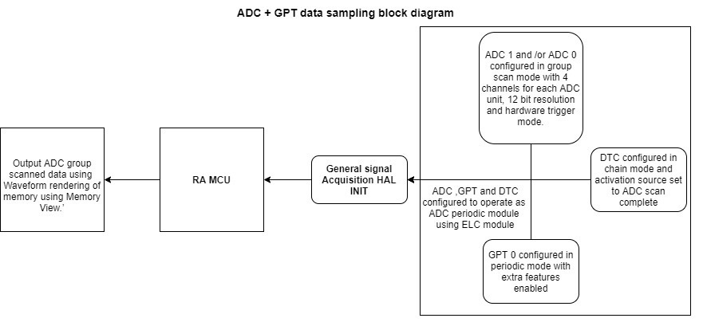

## FSP Modules Used ##
List all the various modules that are used in this example project. Refer to the FSP User Manual for further details on each module listed below.

| Module Name | Usage  | Searchable Keyword (using New Stack > Search) |
|-------------|-----------------------------------------------|-----------------------------------------------|
| ADC | ADC is used in group scan mode to scan the input sinusoidal signal connected to ADC channels. | ADC |
| DTC | DTC is used to transfer data from the ADC data registers to the circular buffer. | DTC |
| GPT | GPT is used to generate ADC group scan trigger at periodic interval. | GPT |
| ELC | ELC is used to link ADC with GPT module for Hardware triggering. | ELC |

## Module Configuration Notes ##
This section describes FSP Configurator properties which are important or different than those selected by default. 

**Configuration Properties for using ADC:**
|   Module Property Path and Identifier   |   Default Value   |   Used Value   |   Reason   |
| :-------------------------------------: | :---------------: | :------------: | :--------: |
| configuration.xml > Stacks > g_adc0 ADC Driver on r_adc_b > Properties > Settings > Property > Module g_adc0 ADC Driver on r_adc_b > Interrupts > Callback | NULL | g_adc0_callback | Called from the ISR when the ADC scan completes. |

**Note:** ADC_B uses a single driver instance (g_adc0) to control both ADC Unit 0 and ADC Unit 1. For clarity, this guideline separates the configuration by ADC unit:
  * **Configuration Properties for using ADC unit 0:**  

|   Module Property Path and Identifier   |   Default Value   |   Used Value   |   Reason   |
| :-------------------------------------: | :---------------: | :------------: | :--------: |
| configuration.xml > Stacks > g_adc0 ADC Driver on r_adc_b > Properties > Settings > Property > Module g_adc0 ADC Driver on r_adc_b > General > Operation > ADC 0 > Scan Mode | Single Scan | Single Scan | Specify the scan mode for this ADC unit. |
| configuration.xml > Stacks > g_adc0 ADC Driver on r_adc_b > Properties > Settings > Property > Module g_adc0 ADC Driver on r_adc_b > Interrupts > Scan End Priority > Group 0 | Priority 12 | Priority 2 | Set the scan end interrupt priority for Group 0. |
| configuration.xml > Stacks > g_adc0 ADC Driver on r_adc_b > Properties > Settings > Property > Module g_adc0 ADC Driver on r_adc_b > Interrupts > Scan End Priority > Group 1 | Priority 12 | Priority 2 | Set the scan end interrupt priority for Group 1. |
| configuration.xml > Stacks > g_adc0 ADC Driver on r_adc_b > Properties > Settings > Property > Module g_adc0 ADC Driver on r_adc_b > Virtual Channels > Virtual Channel 0 > Scan Group | None | Scan Group 0 | Select the scan group for this virtual channel. |
| configuration.xml > Stacks > g_adc0 ADC Driver on r_adc_b > Properties > Settings > Property > Module g_adc0 ADC Driver on r_adc_b > Virtual Channels > Virtual Channel 0 > Channel Select | ADC Channel 0 | ADC Channel 1 | Select the physical channel for this virtual channel. |
| configuration.xml > Stacks > g_adc0 ADC Driver on r_adc_b > Properties > Settings > Property > Module g_adc0 ADC Driver on r_adc_b > Virtual Channels > Virtual Channel 1 > Scan Group | None | Scan Group 0 | Select the scan group for this virtual channel. |
| configuration.xml > Stacks > g_adc0 ADC Driver on r_adc_b > Properties > Settings > Property > Module g_adc0 ADC Driver on r_adc_b > Virtual Channels > Virtual Channel 1 > Channel Select | ADC Channel 0 | ADC Channel 2 | Select the physical channel for this virtual channel. |
| configuration.xml > Stacks > g_adc0 ADC Driver on r_adc_b > Properties > Settings > Property > Module g_adc0 ADC Driver on r_adc_b > Virtual Channels > Virtual Channel 2 > Scan Group | None | Scan Group 1 | Select the scan group for this virtual channel. |
| configuration.xml > Stacks > g_adc0 ADC Driver on r_adc_b > Properties > Settings > Property > Module g_adc0 ADC Driver on r_adc_b > Virtual Channels > Virtual Channel 2 > Channel Select | ADC Channel 0 | ADC Channel 4 | Select the physical channel for this virtual channel. |
| configuration.xml > Stacks > g_adc0 ADC Driver on r_adc_b > Properties > Settings > Property > Module g_adc0 ADC Driver on r_adc_b > Virtual Channels > Virtual Channel 3 > Scan Group | None | Scan Group 1 | Select the scan group for this virtual channel. |
| configuration.xml > Stacks > g_adc0 ADC Driver on r_adc_b > Properties > Settings > Property > Module g_adc0 ADC Driver on r_adc_b > Virtual Channels > Virtual Channel 3 > Channel Select | ADC Channel 0 | ADC Channel 5 | Select the physical channel for this virtual channel. |
| configuration.xml > Stacks > g_adc0 ADC Driver on r_adc_b > Properties > Settings > Property > Module g_adc0 ADC Driver on r_adc_b > Scan Groups > Scan Group 0 > GPT Trigger Enable > GPT Trigger A0 | ☐ | ☑ | Enable GPT trigger A0 for Group 0 scanning. |
| configuration.xml > Stacks > g_adc0 ADC Driver on r_adc_b > Properties > Settings > Property > Module g_adc0 ADC Driver on r_adc_b > Scan Groups > Scan Group 0 > Enable | Disable | Enable | Enable scan group 0. |
| configuration.xml > Stacks > g_adc0 ADC Driver on r_adc_b > Properties > Settings > Property > Module g_adc0 ADC Driver on r_adc_b > Scan Groups > Scan Group 0 > Converter Selection | ADC 0 | ADC 0 | Select the A/D converter used with this scan group. |
| configuration.xml > Stacks > g_adc0 ADC Driver on r_adc_b > Properties > Settings > Property > Module g_adc0 ADC Driver on r_adc_b > Scan Groups > Scan Group 1 > GPT Trigger Enable > GPT Trigger B0 | ☐ | ☑ | Enable GPT trigger B0 for Group 1 scanning. |
| configuration.xml > Stacks > g_adc0 ADC Driver on r_adc_b > Properties > Settings > Property > Module g_adc0 ADC Driver on r_adc_b > Scan Groups > Scan Group 1 > Enable | Disable | Enable | Enable scan group 1. |
| configuration.xml > Stacks > g_adc0 ADC Driver on r_adc_b > Properties > Settings > Property > Module g_adc0 ADC Driver on r_adc_b > Scan Groups > Scan Group 1 > Converter Selection | ADC 0 | ADC 0 | Select the A/D converter used with this scan group. |

  * **Configuration Properties for using ADC unit 1:**

|   Module Property Path and Identifier   |   Default Value   |   Used Value   |   Reason   |
| :-------------------------------------: | :---------------: | :------------: | :--------: |
| configuration.xml > Stacks > g_adc0 ADC Driver on r_adc_b > Properties > Settings > Property > Module g_adc0 ADC Driver on r_adc_b > General > Operation > ADC 1 > Scan Mode | Single Scan | Single Scan | Specifies the scan mode for this ADC unit. |
| configuration.xml > Stacks > g_adc0 ADC Driver on r_adc_b > Properties > Settings > Property > Module g_adc0 ADC Driver on r_adc_b > Interrupts > Scan End Priority > Group 2 | Priority 12 | Priority 2 | Set the scan end interrupt priority for Group 2. |
| configuration.xml > Stacks > g_adc0 ADC Driver on r_adc_b > Properties > Settings > Property > Module g_adc0 ADC Driver on r_adc_b > Interrupts > Scan End Priority > Group 3 | Priority 12 | Priority 2 | Set the scan end interrupt priority for Group 3. |
| configuration.xml > Stacks > g_adc0 ADC Driver on r_adc_b > Properties > Settings > Property > Module g_adc0 ADC Driver on r_adc_b > Virtual Channels > Virtual Channel 4 > Scan Group | None | Scan Group 2 | Select the scan group for this virtual channel. |
| configuration.xml > Stacks > g_adc0 ADC Driver on r_adc_b > Properties > Settings > Property > Module g_adc0 ADC Driver on r_adc_b > Virtual Channels > Virtual Channel 4 > Channel Select | ADC Channel 0 | ADC Channel 6 | Select the physical channel for this virtual channel. |
| configuration.xml > Stacks > g_adc0 ADC Driver on r_adc_b > Properties > Settings > Property > Module g_adc0 ADC Driver on r_adc_b > Virtual Channels > Virtual Channel 5 > Scan Group | None | Scan Group 2 | Select the scan group for this virtual channel. |
| configuration.xml > Stacks > g_adc0 ADC Driver on r_adc_b > Properties > Settings > Property > Module g_adc0 ADC Driver on r_adc_b > Virtual Channels > Virtual Channel 5 > Channel Select | ADC Channel 0 | ADC Channel 7 | Select the physical channel for this virtual channel. |
| configuration.xml > Stacks > g_adc0 ADC Driver on r_adc_b > Properties > Settings > Property > Module g_adc0 ADC Driver on r_adc_b > Virtual Channels > Virtual Channel 6 > Scan Group | None | Scan Group 3 | Select the scan group for this virtual channel. |
| configuration.xml > Stacks > g_adc0 ADC Driver on r_adc_b > Properties > Settings > Property > Module g_adc0 ADC Driver on r_adc_b > Virtual Channels > Virtual Channel 6 > Channel Select | ADC Channel | ADC Channel 10 | Select the physical channel for this virtual channel. |
| configuration.xml > Stacks > g_adc0 ADC Driver on r_adc_b > Properties > Settings > Property > Module g_adc0 ADC Driver on r_adc_b > Virtual Channels > Virtual Channel 7 > Scan Group | None | Scan Group 3 | Select the scan group for this virtual channel. |
| configuration.xml > Stacks > g_adc0 ADC Driver on r_adc_b > Properties > Settings > Property > Module g_adc0 ADC Driver on r_adc_b > Virtual Channels > Virtual Channel 7 > Channel Select | ADC Channel 0 | ADC Channel 13 | Select the physical channel for this virtual channel. |
| configuration.xml > Stacks > g_adc0 ADC Driver on r_adc_b > Properties > Settings > Property > Module g_adc0 ADC Driver on r_adc_b > Scan Groups > Scan Group 2 > GPT Trigger Enable > GPT Trigger A0 | ☐ | ☑ | Enable GPT trigger A0 for Group 2 scanning. |
| configuration.xml > Stacks > g_adc0 ADC Driver on r_adc_b > Properties > Settings > Property > Module g_adc0 ADC Driver on r_adc_b > Scan Groups > Scan Group 2 > Enable | Disable | Enable | Enable scan group 2. |
| configuration.xml > Stacks > g_adc0 ADC Driver on r_adc_b > Properties > Settings > Property > Module g_adc0 ADC Driver on r_adc_b > Scan Groups > Scan Group 2 > Converter Selection | ADC 0 | ADC 1 | Select the A/D converter used with this scan group. |
| configuration.xml > Stacks > g_adc0 ADC Driver on r_adc_b > Properties > Settings > Property > Module g_adc0 ADC Driver on r_adc_b > Scan Groups > Scan Group 3 > GPT Trigger Enable > GPT Trigger B0 | ☐ | ☑ | Enable GPT trigger B0 for Group 3 scanning. |
| configuration.xml > Stacks > g_adc0 ADC Driver on r_adc_b > Properties > Settings > Property > Module g_adc0 ADC Driver on r_adc_b > Scan Groups > Scan Group 3 > Enable | Disable | Enable | Enable scan group 3. |
| configuration.xml > Stacks > g_adc0 ADC Driver on r_adc_b > Properties > Settings > Property > Module g_adc0 ADC Driver on r_adc_b > Scan Groups > Scan Group 3 > Converter Selection | ADC 0 | ADC 1 | Select the A/D converter used with this scan group. |

**Configuration Properties for using Timer, General PWM (GPT)**

|   Module Property Path and Identifier   |   Default Value   |   Used Value   |   Reason   |
| :-------------------------------------: | :---------------: | :------------: | :--------: |
| configuration.xml > Stacks > g_timer0 Timer, General PWM (r_gpt) > Properties > Settings > Property > Common > Pin Output Support | Disabled | Enabled with Extra Features | Enable PWM waveform output on GTIOCx pins and allows the timer to generate external signals for triggering or monitoring. |
| configuration.xml > Stacks > g_timer0 Timer, General PWM (r_gpt) > Properties > Settings > Property > Module g_timer0 Timer, General PWM (r_gpt) > General > Period | 0x10000 | 21 | Define the timer period, which determines how frequently trigger events are generated based on application-specific sampling requirements. |
| configuration.xml > Stacks > g_timer0 Timer, General PWM (r_gpt) > Properties > Settings > Property > Module g_timer0 Timer, General PWM (r_gpt) > General > Period Unit | Raw count | Microseconds | Unit of the period specified above. |
| configuration.xml > Stacks > g_timer0 Timer, General PWM (r_gpt) > Properties > Settings > Property > Module g_timer0 Timer, General PWM (r_gpt) > Extra Features > ADC Trigger > Start Event Trigger (Channels with GTINTAD only) > Trigger Event A/D Converter Start Request A During Up Counting | ☐ | ☑ | Enable GPT to generate an ADC Start Request A event when the counter is in the up-counting phase. Used to synchronize ADC start timing with the GPT cycle. |
| configuration.xml > Stacks > g_timer0 Timer, General PWM (r_gpt) > Properties > Settings > Property > Module g_timer0 Timer, General PWM (r_gpt) > Extra Features > ADC Trigger > Start Event Trigger (Channels with GTINTAD only) > Trigger Event A/D Converter Start Request B During Up Counting | ☐ | ☑ | Enable GPT to generate an ADC Start Request B event during the up-counting phase. Often used when two independent ADC trigger points are needed. |
| configuration.xml > Stacks > g_timer0 Timer, General PWM (r_gpt) > Properties > Settings > Property > Module g_timer0 Timer, General PWM (r_gpt) > Extra Features > ADC Trigger > ADC A Compare Match (Raw Counts) | 0 | 3150 | Set the timer compare match value that generates the GPTn AD TRIG A event. This determines the exact timing within the GPT cycle when the ADC is triggered. |
| configuration.xml > Stacks > g_timer0 Timer, General PWM (r_gpt) > Properties > Settings > Property > Module g_timer0 Timer, General PWM (r_gpt) > Extra Features > ADC Trigger > ADC B Compare Match (Raw Counts) | 0 | 6237 | Set the compare match value corresponding to GPTn AD TRIG B event. Allows triggering ADC at a second precise point in the timer cycle. |
| configuration.xml > Stacks > g_timer0 Timer, General PWM (r_gpt) > Properties > Settings > Property > Module g_timer0 Timer, General PWM (r_gpt) > Interrupts > Capture/Compare match A Interrupt Priority | Disable | Priority 2 | Select the timer Capture/Compare match A interrupt priority. |

**Configuration Properties for using ADC unit 0 group A Transfer (DTC)**
|   Module Property Path and Identifier   |   Default Value   |   Used Value   |   Reason   |
| :-------------------------------------: | :---------------: | :------------: | :--------: |
| configuration.xml > Stacks > g_transfer_adc0_group_a Transfer (r_dtc) > Properties > Settings > Property > Module g_transfer_adc0_group_a Transfer (r_dtc) > Mode | Normal | Repeat | One transfer per activation, Repeat Area address reset after Number of Transfers, transfer repeats until stopped. |
| configuration.xml > Stacks > g_transfer_adc0_group_a Transfer (r_dtc) > Properties > Settings > Property > Module g_transfer_adc0_group_a Transfer (r_dtc) > Destination Address Mode | Fixed | Incremented | Select the address mode for the destination. Destination address get incremented after each transfer.|
| configuration.xml > Stacks > g_transfer_adc0_group_a Transfer (r_dtc) > Properties > Settings > Property > Module g_transfer_adc0_group_a Transfer (r_dtc) > Repeat Area (Unused in Normal Mode) | Source | Destination | Destination address resets to its initial value after completing Number of Transfers. |
| configuration.xml > Stacks > g_transfer_adc0_group_a Transfer (r_dtc) > Properties > Settings > Property > Module g_transfer_adc0_group_a Transfer (r_dtc) > Number of Transfers | 0 | 64 | Specify the number of transfers to be performed. |
| configuration.xml > Stacks > g_transfer_adc0_group_a Transfer (r_dtc) > Properties > Settings > Property > Module g_transfer_adc0_group_a Transfer (r_dtc) > Activation Source | Disable | ADC ADI0 (End of A/D scanning operation(Gr.0)) | Select the DTC transfer start event. |

**Configuration Properties for using ADC unit 0 group B Transfer (DTC)**
|   Module Property Path and Identifier   |   Default Value   |   Used Value   |   Reason   |
| :-------------------------------------: | :---------------: | :------------: | :--------: |
| configuration.xml > Stacks > g_transfer_adc0_group_b Transfer (r_dtc) > Properties > Settings > Property > Module g_transfer_adc0_group_b Transfer (r_dtc) > Mode | Normal | Repeat | One transfer per activation, Repeat Area address reset after Number of Transfers, transfer repeats until stopped. |
| configuration.xml > Stacks > g_transfer_adc0_group_b Transfer (r_dtc) > Properties > Settings > Property > Module g_transfer_adc0_group_b Transfer (r_dtc) > Destination Address Mode | Fixed | Incremented | Select the address mode for the destination. Destination address get incremented after each transfer.|
| configuration.xml > Stacks > g_transfer_adc0_group_b Transfer (r_dtc) > Properties > Settings > Property > Module g_transfer_adc0_group_b Transfer (r_dtc) > Repeat Area (Unused in Normal Mode) | Source | Destination | Destination address resets to its initial value after completing Number of Transfers. |
| configuration.xml > Stacks > g_transfer_adc0_group_b Transfer (r_dtc) > Properties > Settings > Property > Module g_transfer_adc0_group_b Transfer (r_dtc) > Number of Transfers | 0 | 64 | Specify the number of transfers to be performed. |
| configuration.xml > Stacks > g_transfer_adc0_group_b Transfer (r_dtc) > Properties > Settings > Property > Module g_transfer_adc0_group_b Transfer (r_dtc) > Activation Source | Disable | ADC ADI1 (End of A/D scanning operation(Gr.1)) | Select the DTC transfer start event. |

**Configuration Properties for using ADC unit 1 group A Transfer (DTC)**
|   Module Property Path and Identifier   |   Default Value   |   Used Value   |   Reason   |
| :-------------------------------------: | :---------------: | :------------: | :--------: |
| configuration.xml > Stacks > g_transfer_adc1_group_a Transfer (r_dtc) > Properties > Settings > Property > Module g_transfer_adc1_group_a Transfer (r_dtc) > Mode | Normal | Repeat | One transfer per activation, Repeat Area address reset after Number of Transfers, transfer repeats until stopped. |
| configuration.xml > Stacks > g_transfer_adc1_group_a Transfer (r_dtc) > Properties > Settings > Property > Module g_transfer_adc1_group_a Transfer (r_dtc) > Destination Address Mode | Fixed | Incremented | Select the address mode for the destination. Destination address get incremented after each transfer.|
| configuration.xml > Stacks > g_transfer_adc1_group_a Transfer (r_dtc) > Properties > Settings > Property > Module g_transfer_adc1_group_a Transfer (r_dtc) > Repeat Area (Unused in Normal Mode) | Source | Destination | Destination address resets to its initial value after completing Number of Transfers. |
| configuration.xml > Stacks > g_transfer_adc1_group_a Transfer (r_dtc) > Properties > Settings > Property > Module g_transfer_adc1_group_a Transfer (r_dtc) > Number of Transfers | 0 | 64 | Specify the number of transfers to be performed. |
| configuration.xml > Stacks > g_transfer_adc1_group_a Transfer (r_dtc) > Properties > Settings > Property > Module g_transfer_adc1_group_a Transfer (r_dtc) > Activation Source | Disable | ADC ADI2 (End of A/D scanning operation(Gr.2)) | Select the DTC transfer start event. |

**Configuration Properties for using ADC unit 1 group B Transfer (DTC)**
|   Module Property Path and Identifier   |   Default Value   |   Used Value   |   Reason   |
| :-------------------------------------: | :---------------: | :------------: | :--------: |
| configuration.xml > Stacks > g_transfer_adc1_group_b Transfer (r_dtc) > Properties > Settings > Property > Module g_transfer_adc1_group_b Transfer (r_dtc) > Mode | Normal | Repeat | One transfer per activation, Repeat Area address reset after Number of Transfers, transfer repeats until stopped. |
| configuration.xml > Stacks > g_transfer_adc1_group_b Transfer (r_dtc) > Properties > Settings > Property > Module g_transfer_adc1_group_b Transfer (r_dtc) > Destination Address Mode | Fixed | Incremented | Select the address mode for the destination. Destination address get incremented after each transfer.|
| configuration.xml > Stacks > g_transfer_adc1_group_b Transfer (r_dtc) > Properties > Settings > Property > Module g_transfer_adc1_group_b Transfer (r_dtc) > Repeat Area (Unused in Normal Mode) | Source | Destination | Destination address resets to its initial value after completing Number of Transfers. |
| configuration.xml > Stacks > g_transfer_adc1_group_b Transfer (r_dtc) > Properties > Settings > Property > Module g_transfer_adc1_group_b Transfer (r_dtc) > Number of Transfers | 0 | 64 | Specify the number of transfers to be performed. |
| configuration.xml > Stacks > g_transfer_adc1_group_b Transfer (r_dtc) > Properties > Settings > Property > Module g_transfer_adc1_group_b Transfer (r_dtc) > Activation Source | Disable | ADC ADI3 (End of A/D scanning operation(Gr.3)) | Select the DTC transfer start event. |

## API Usage ##
The table below lists the FSP provided API used at the application layer by this example project.

| API Name    | Usage                                                                          |
|-------------|--------------------------------------------------------------------------------|
| R_ADC_B_Open | This API is used to open the ADC_B instance. |
| R_ADC_B_ScanCfg | This API is used to configure the ADC_B scan parameters. |
| R_ADC_B_Calibrate | This API is used to initiate ADC_B calibration. |
| R_ADC_B_StatusGet | This API is used to retrieve the current status of the ADC_B instance. |
| R_ADC_B_ScanStart | This API is used to start scanning ADC channels. In periodic operation, the API waits for the trigger events to occur. |
| R_ADC_B_Close | This API is used to close the opened ADC instance, when any failure occur. |
| R_DTC_Open | This API is used to open the DTC instance and initializes it to transfer data on specified activation events. |
| R_DTC_Reconfigure | This API is used to reconfigure DTC with chain mode transfer settings. |
| R_DTC_Enable | This API is used to enable data transfers for the specified activation source. Transfers occur on every group scan complete event. |
| R_DTC_Close | This API is used to close the opened DTC instance, when any failure occur. |
| R_GPT_Open | This API is used to initializes the timer module and applies configurations. |
| R_GPT_Start | This API is used to start the GPT timer in periodic mode; triggers ADC group scans at the configured intervals. |
| R_GPT_Close | This API is used to close the opened GPT instance, when any failure occur. |
| R_ELC_Open | This API is used to open the ELC instance to allow event linkage. |
| R_ELC_Enable | This API is used to enable the ELC instance to propagate events to linked peripherals. |
| R_ELC_Close | This API is used to close the opened ELC instance, when any failure occur. |

## Verifying Operation ##
### Setting up waveform rendering ###
* To set waveform rendering, the user needs to first debug the code, then go to memory view and add g_user buffer under memory monitor.
* The user can view any of the respective channel by adding specific ADC Unit buffer under memory monitor. For example ADC Unit 0 Group A Channel 0 samples can be viewed by selecting &g_buffer_adc[0][0][0].
  This way other ADC Units, groups, and channels can be selected. 
* Then click on New Rendering -> Waveform -> Waveform properties  
* The configuration parameters of the Waveform properties are as follows:  
  - Select Data Size: 	16bit
  - User-specified: 	  Tick on the box
  - Minimum values: 	  0
  - Maximum values: 	  4095
  - Channel:		        Mono
  - Buffer size:		    512
  
**Note:** 12-bit ADC will have minimum and maximum value between 0-4095. As Ping-Pong buffer is used, the buffer size is 512 (i.e., 256*2) for each channel, where 2 denotes the number of buffers and 256 is the size of the buffer.

The user can add the buffer address of each channel in the memory to view the waveform of each channel connected.

* Click Real-time Refresh on Memory monitor tab to check buffer in real-time.

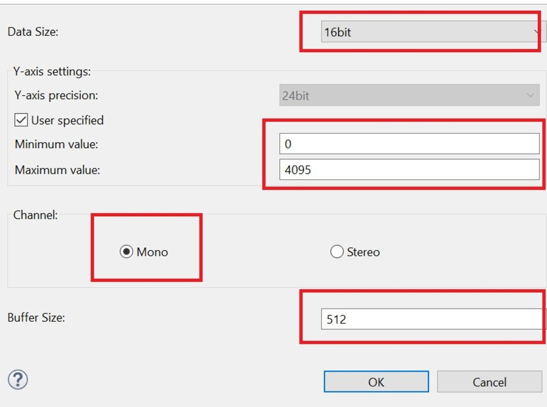 

### Input for Signal generator ###
* The signal needs to be generated from the Signal Generator for the Input to the ADC (0-3V Sinusoidal) with a frequency set to 800Hz.

Import, build and debug the EP (*see section Starting Development* of **FSP User Manual**). After running the EP, open waveform rendering in memory viewer to see the output of sampled data. One can also check the buffer in real-time by adding it to the expression tab.

The images below showcase the output on waveform rendering of ADC Unit 0 for each channel of group A and B:
* ADC Unit 0 Group A channel 1 (g_buffer_adc[0][0][0]) and channel 2 (g_buffer_adc[0][0][1]):

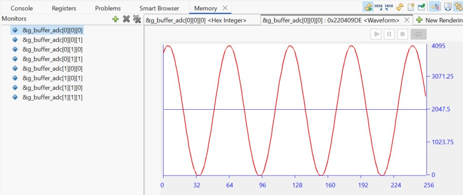 

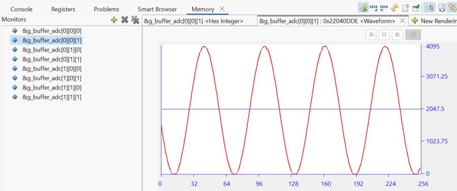

* ADC Unit 0 Group B channel 4 (g_buffer_adc[0][1][0]) and channel 5 (g_buffer_adc[0][1][1]):

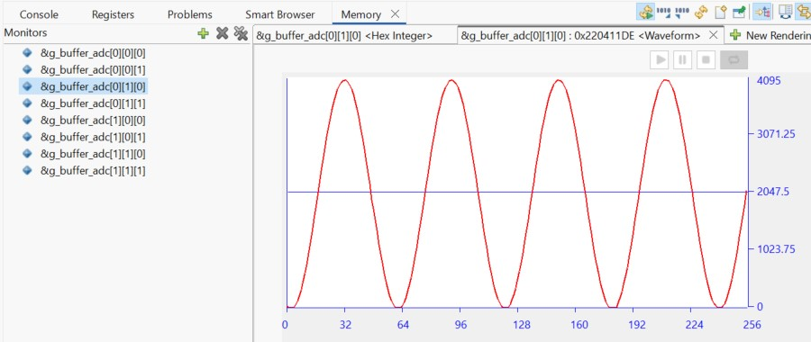 

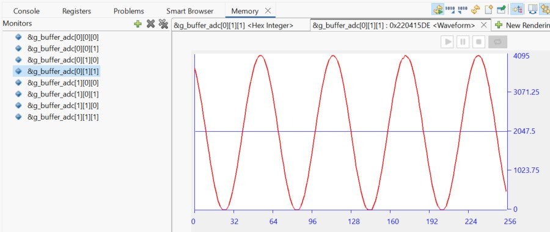

* ADC Unit 1 Group A channel 6 (g_buffer_adc[1][0][0]) and channel 7 (g_buffer_adc[1][0][1]):

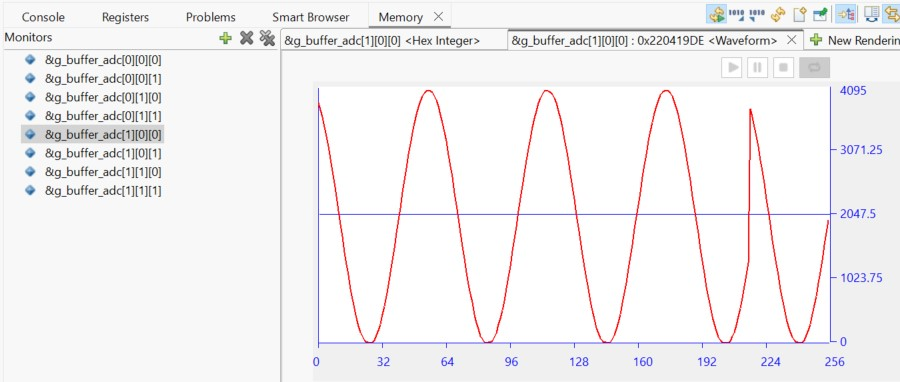 

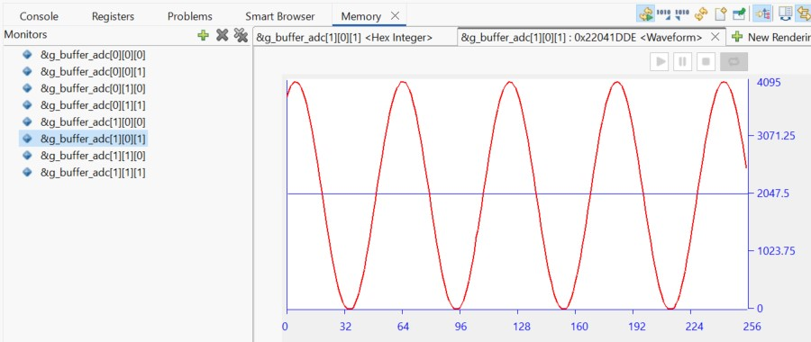

* ADC Unit 1 Group B channel 10 (g_buffer_adc[1][1][0]) and channel 13 (g_buffer_adc[1][1][1]):

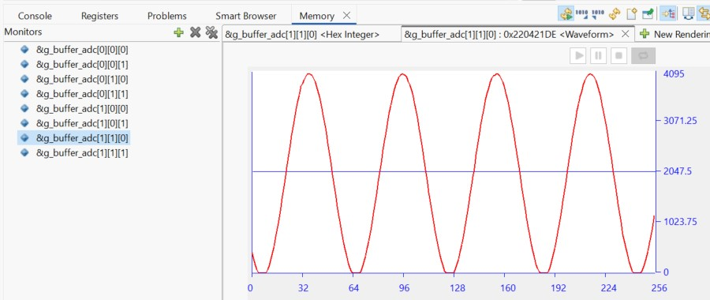 

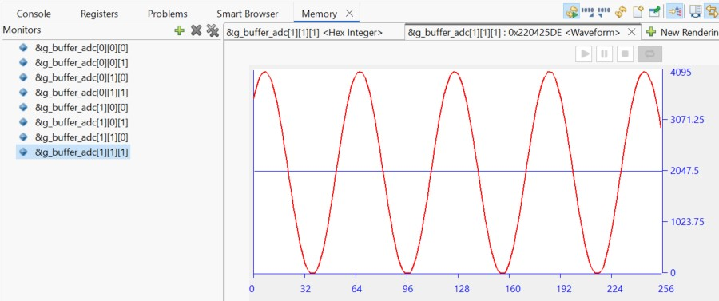

## Special Topics ##
### Setting up Chain Mode in DTC ###
* The chain mode can be setup by declaring local transfer info structure containing info related to Chain Mode Transfer and configure DTC with same info.
  The table below lists the transfer info elements required for chain transfer
  | Transfer info element   | transfer info 0               |       transfer info 1              |
  |-------------|-------------------------------------------|------------------------------------|
  | Transfer mode | Normal mode| Normal mode |
  | Source address control | Fixed | Fixed |
  | Destination address control | Incremented | Incremented |
  | Chain transfer  | Enabled | Disable |
  | Transfer block size | 2 bytes | 2 bytes |
  | Transfer source address | &R_ADDR0| &R_ADDR1 |
  | Transfer destination address | g_buffer[unit0][Group scan A][channel 0][0][0]| g_buffer[unit0][Group scan A][channel 1][0][0]|
  
**Note:** Above table shows chain transfer for group A of ADC Unit 0 same way this can be updated for other ADC units and groups. The user can also update their info as per requirement
* After A/D conversion is completed, the DTC is activated by an A/D Scan complete interrupt request. Once the DTC is activated, it reads transfer info for transfer_adc_groupA[0] which is a local buffer, and copy values of register ADDR0 to the destination buffer location of DTC g_buffer_adc[0]. Since chain transfer is enabled, so the DTC successively reads transfer_adc_groupA[1] (i.e., channel 1 of group A).
* Once DTC operation for transfer_adc_groupA[1] starts it transfers values of registers ADDR1 to the destination buffer g_buffer_adc[1]. Since chain transfer is disabled in transfer info of A[1], data transfer by the DTC is completed here.
* DTC transfer completes the operation of one group, an A/D conversion interrupt is generated after DTC transfer is completed for the other ADC group and the same process repeats for group B.
  
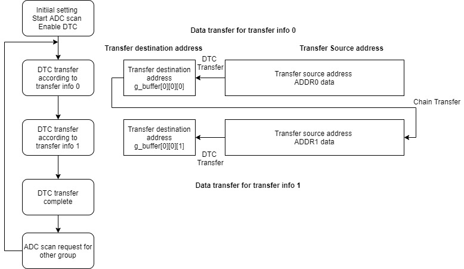

### Calculating Time period and ADC Trigger Raw count ###
* To calculate the Time period of GPT timer use   
  Time period = 1/input frequency (where input sampling frequency is 2 * signal generator input frequency).  
  This calculated Time Period can be set as GPT Time period in the properties tab.
* To calculate Raw period count for ADC trigger use  
  Raw period count =  (Time period in seconds * (PCLKD / (2^ Prescaler)))  
  (where Prescaler value is 0 by default so 2^0 = 1)  
  **Note :** PCLKD frequency will vary as per MCU variant.
* ADC Trigger value for ADC Compare match value for A and B are set to 50% and 99% duty cycle (Raw period count).  
 So ADC Compare match value for A = (0.5 * Raw period count) and ADC Compare match value for B = (0.99 * Raw period count). ADC Compare A and B Match raw count values are supported for MCUs supporting enhanced GPT timer.  
 For MCUs without enhanced GPT timer support, the user only needs to set GPT Time period as ADC group are set to trigger ADC group A at 50% of the cycle and ADC group B at full cycle (GPT overflow interrupt).

### Ping Pong Buffer Operation ###
* The DTC is used to transfer data from the ADC data registers to the Ping-Pong buffer.
* Using the DTC allows the CPU to be used for other operations.
* When the first buffer is filled completely (i.e., desired sample size), a DTC activation source generates an interrupt to the CPU.
* The CPU executes the ADC Interrupt service routine to:
  * Switch to the DTC to fill the second buffer with ADC values.
  * Allow processing on the data available in the first buffer.

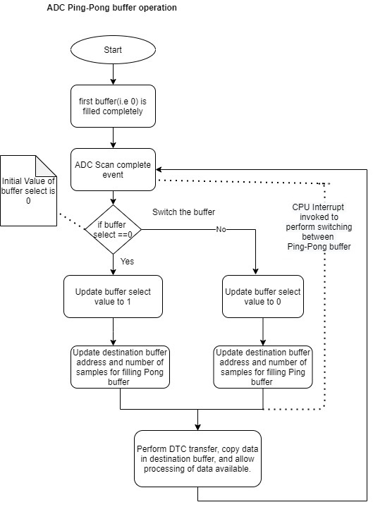
