# Introduction #
This project demonstrates the basic functionality of AWS https client library with ethernet driver on Renesas RA MCUs based on Renesas FSP using FreeRTOS. AWS client is used to connect to https adafruit server which is cloud platform. On successful connection, menu is displayed enabling user to send GET, PUT, POST requests to adafruit server. On POST/PUT request, MCU Die temperature is read via (using) ADC and uploaded to server. On GET request, the last MCU die temperature data is read from the adafruit server. J-Link RTT Viewer is used to display the status and responses of the requests made to server.

Please refer to the [Example Project Usage Guide](https://github.com/renesas/ra-fsp-examples/blob/master/example_projects/Example%20Project%20Usage%20Guide.pdf) for general information on example projects and [readme.txt](./readme.txt) for specifics of operation.

## Required Resources ##
To build and run the aws_https_client example project, the following resources are needed.

### Software ###
1. Refer to the software required section in [Example Project Usage Guide](https://github.com/renesas/ra-fsp-examples/blob/master/example_projects/Example%20Project%20Usage%20Guide.pdf)
2. Refer to **Special Topics** for obtaining the certificates and key which is required to update in the code.

### Hardware ###
* Supported RA boards: EK-RA6M3, EK-RA6M5, EK-RA8M1, EK-RA8D1, MCK-RA8T1, EK-RA8M2.
  * 1 x Renesas RA board.	
  * 1 x Type-C USB cable for programming and debugging.
  * 1 x LAN cable.
  * 1 x Ethernet switch.

### Hardware Connections ###
* Connect the USB Debug port on the RA board to the host PC via a Type-C USB cable.
* Connect RA board ethernet port to the ethernet switch/router via a LAN cable.  
  Note: The Switch should have WAN connection to communicate the server over internet and connect to the router which is connected to the Internet.
* For EK-RA8D1:
  * Set the configuration switches (SW1) as below to avoid potential failures.
      | SW1-1 PMOD1 | SW1-2 TRACE | SW1-3 CAMERA | SW1-4 ETHA | SW1-5 ETHB | SW1-6 GLCD | SW1-7 SDRAM | SW1-8 I3C |
      |-------------|-------------|--------------|------------|------------|------------|-------------|-----------|
      | OFF | OFF | OFF | OFF | ON | OFF | OFF | OFF |
  * CAUTION: Do not enable SW1-4 and SW1-5 together.
* For EK-RA8M1: The user must remove jumper J61 to enable Ethernet B.
* For EK-RA8M2: The user must place jumper J6 on pins 2-3, J8 on pins 1-2, J9 on pins 2-3, and J29 on pins 1-2, 3-4, 5-6, 7-8 to use the on-board debug functionality.

## Related Collateral References ##
The following documents can be referred to for enhancing your understanding of the operation of this example project:
- [FSP User Manual on GitHub](https://renesas.github.io/fsp/)
- [FSP Known Issues](https://github.com/renesas/fsp/issues)

# Project Notes #

## System Level Block Diagram ##
 High level block diagram
 
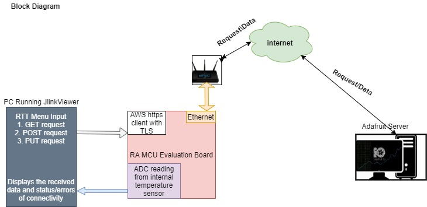

## FSP Modules Used ##
List all the various modules that are used in this example project. Refer to the FSP User Manual for further details on each module listed below.

| Module Name | Usage | searchable Keyword |
|-------------|-----------------------------------------------|-----------------------------------------------|
| AWS Core HTTP | To get access of AWS client library for client connection. | AWS Core HTTP |
| FreeRTOS + TCP | To get access of TCP/IP network library to form network layer. | rm_freertos_plus_tcp |
| Ethernet Driver | This is dependent module of FreeRTOS+TCP to get access of physical layer of FSP board with the help of ethernet driver. | r_rmac & r_rmac_phy |
| MbedTLS | This is dependent module of FreeRTOS MbedTLS which is used for server/client certificate parsing. | mbedTLS |
| Mbed Crypto | This is dependent module of MbedTLS which is used for secure TLS connection. | rm_psa_crypto |
| SCE | This module provides SCE functions for compatibility mode. | r_sce |
| Littlefs | To store RSA keys in flash memory. | rm_littlefs_flash |
| ADC_B | ADC_B module is used to demonstrate that to read internal temperature sensor value and send it to the server. | r_adc_b |

## Module Configuration Notes ##
This section describes FSP configurator properties which are important or different from those selected by default.

|   Module Property Path and Identifier   |   Default Value   |   Used Value   |   Reason   |
| :-------------------------------------: | :---------------: | :------------: | :--------: |
| configuration.xml > BSP > Properties > Settings > Property > Main stack size (bytes)| 0x400 | 0x1000 | Main Program thread stack is configured to store the local variables of different functions in the code. |
| configuration.xml > BSP > Properties > Settings > Property > Heap size (bytes)| 0 | 0x2000 | Heap size is required for standard library functions to be used. |
| configuration.xml > User App Thread > Properties > Settings > Property > Common > Memory Allocation > Support Dynamic Allocation | Disabled | Enabled | RTOS objects can be created using RAM that is automatically allocated from the FreeRTOS heap. |
| configuration.xml > User App Thread > Properties > Settings > Property > Common > Memory Allocation > Total Heap Size | 0 | 0x20000 | RAM is used to obtain memory allocation for secure libraries. |
| configuration.xml > User App Thread > Properties > Settings > Property > Common > General > Use Mutexes | Disabled | Enabled | Enabled to include mutex functionality. |
| configuration.xml > User App Thread > Properties > Settings > Property > Common > General > Use Recursive Mutexes | Disabled | Enabled | Enabled to include recursive mutex functionality. |
| configuration.xml > User App Thread > Properties > Settings > Property > Thread > Stack size (bytes) | 1024 | 25000 | Stack size for User App thread. | 
| configuration.xml > User App Thread > Properties > Settings > Property > Thread > Priority | 1 | 2 | Priority for User App thread. |
| configuration.xml > User App Thread > Properties > Settings > Property > Common > Optional Functions > eTaskGetState() Function | Disabled | Enabled | Include eTaskGetState() function in build. |
| configuration.xml > User App Thread > Properties > Settings > Property > Common > Optional Functions > xTaskGetHandle() Function | Disabled | Enabled | Include xTaskGetHandle() function in build. |
| configuration.xml > User App Thread > AWS Core HTTP > Properties > Settings > Property > Common > HTTP Receive Retry Timeout (ms) | 1 | 200 | The maximum duration between non-empty network reads while receiving an HTTP response via the HTTPClient_Send API function. | 
| configuration.xml > User App Thread > AWS Core HTTP > Properties > Settings > Property > Common > HTTP Send Retry Timeout (ms) | 1 | 200 | The maximum duration between non-empty network transmissions while sending an HTTP request via the HTTPClient_Send API function. |  
| configuration.xml > User App Thread > AWS Core HTTP > AWS Transport Interface on MbedTLS/PKCS11 (rm_aws_transport_interface_port) > AWS TCP Sockets Wrapper > FreeRTOS+TCP > Properties > Settings > Property > Common > DHCP callback function | Disable | Enable | DHCP callback function is required to obtain dynamic IP address. |
| configuration.xml > User App Thread > AWS Core HTTP > AWS Transport Interface on MbedTLS/PKCS11 (rm_aws_transport_interface_port) > AWS TCP Sockets Wrapper > FreeRTOS+TCP > Properties > Settings > Property > Common > Let TCP use windowing mechanism | Disable | Enable | For Flow control use the TCP windowing mechanism. |
| configuration.xml > User App Thread > AWS Core HTTP > AWS Transport Interface on MbedTLS/PKCS11 (rm_aws_transport_interface_port) > AWS TCP Sockets Wrapper > FreeRTOS+TCP > Properties > Settings > Property > Common > FreeRTOS_SendPingRequest() is available | Disable | Enable | To support the sending of Ping request this needs to chosen as enabled. |
| configuration.xml > User App Thread > AWS Core HTTP > AWS Transport Interface on MbedTLS/PKCS11 (rm_aws_transport_interface_port) > AWS TCP Sockets Wrapper > FreeRTOS+TCP > Properties > Settings > Property > Common > DNS Request Attempts | 2 | 5 | Number of attempts for DNS requests. |
| configuration.xml > User App Thread > AWS Core HTTP > AWS Transport Interface on MbedTLS/PKCS11 (rm_aws_transport_interface_port) > AWS TCP Sockets Wrapper > FreeRTOS+TCP > g_freertos_plus_tcp0 FreeRTOS+TCP Wrapper to ethernet driver (rm_freertos_plus_tcp) > g_ether0 Ethernet MAC (r_rmac) > Properties > Settings > Property > Module g_ether0 Ethernet MAC (r_rmac) > Buffers > Number of TX buffer | 12 | 12 | Buffer size increased for faster processing. |
| configuration.xml > User App Thread > AWS Core HTTP > AWS Transport Interface on MbedTLS/PKCS11 (rm_aws_transport_interface_port) > AWS TCP Sockets Wrapper > FreeRTOS+TCP > g_freertos_plus_tcp0 FreeRTOS+TCP Wrapper to ethernet driver (rm_freertos_plus_tcp) > g_ether0 Ethernet MAC (r_rmac) > Properties > Settings > Property > Module g_ether0 Ethernet MAC (r_rmac) > Buffers > Number of RX buffer | 12 | 12 | Buffer size increased for faster processing. |
|configuration.xml > User App Thread > AWS Core HTTP > AWS Transport Interface on MbedTLS/PKCS11 (rm_aws_transport_interface_port) > AWS TCP Sockets Wrapper > FreeRTOS+TCP > g_freertos_plus_tcp0 FreeRTOS+TCP Wrapper to ethernet driver (rm_freertos_plus_tcp) > g_ether0 Ethernet MAC (r_rmac) > g_layer3_switch0 Switch (r_layer3_switch) > g_rmac_phy0 Ethernet (r_rmac_phy) > Properties > Settings > Property > Module g_rmac_phy0 Ethernet (r_rmac_phy) > Channel | 0 | 1 | Select the Ethernet controller channel number. |
|configuration.xml > User App Thread > AWS Core HTTP > AWS Transport Interface on MbedTLS/PKCS11 (rm_aws_transport_interface_port) > AWS TCP Sockets Wrapper > FreeRTOS+TCP > g_freertos_plus_tcp0 FreeRTOS+TCP Wrapper to ethernet driver (rm_freertos_plus_tcp) > g_ether0 Ethernet MAC (r_rmac) > g_layer3_switch0 Switch (r_layer3_switch) > g_rmac_phy0 Ethernet (r_rmac_phy) > Properties > Settings > Property > Module g_rmac_phy0 Ethernet (r_rmac_phy) > Default PHY-LSI port | 0 | 1 | Specify the default port for PHY-LSI configuration. |
| configuration.xml > User App Thread > AWS Core HTTP > AWS Transport Interface on MbedTLS/PKCS11 (rm_aws_transport_interface_port) > AWS PKCS11 to MbedTLS > FreeRTOS MbedTLS Port > MbedTLS > Properties > Settings > Property > Common > SSL Options > MBEDTLS_SSL_RENEGOTIATION	| Undefine | Define | Enabled support for TLS renegotiation. |
| configuration.xml > User App Thread > AWS Core HTTP > AWS Transport Interface on MbedTLS/PKCS11 (rm_aws_transport_interface_port) > AWS PKCS11 to MbedTLS > FreeRTOS MbedTLS Port > MbedTLS > MbedTLS (Crypto Only) > Properties > Settings > Property > Common > Message Authentication Code (MAC) > MBEDTLS_CMAC_C | Undefine | Define | Enabled macro MBEDTLS_CMAC_C. |
| configuration.xml > User App Thread > AWS Core HTTP > AWS Transport Interface on MbedTLS/PKCS11 (rm_aws_transport_interface_port) > AWS PKCS11 to MbedTLS > FreeRTOS MbedTLS Port > MbedTLS > MbedTLS (Crypto Only) > Properties > Settings > Property > Common > Public Key Cryptography (PKC) > ECC > MBEDTLS_ECDH_C | Undefine | Define | Mbed TLS implements ECDH algorithm. |
| configuration.xml > User App Thread > AWS Core HTTP > AWS Transport Interface on MbedTLS/PKCS11 (rm_aws_transport_interface_port) > AWS PKCS11 to MbedTLS > FreeRTOS MbedTLS Port > MbedTLS > Properties > Settings > Property > Common > Key Exchange > MBEDTLS_KEY_EXCHANGE_PSK_ENABLED | Undefine | Define | Enable the PSK based ciphersuite modes in SSL / TLS. |
| configuration.xml > User App Thread > g_adc ADC Driver on r_adc_b > Properties > Settings > Property > Module g_adc ADC Driver on r_adc_b > General > Operation > ADC 0 > Scan Mode | Single Scan | Continuous Scan | Continuous mode to be selected for continuous reading of ADC value (MCU Die Temperature). |
| configuration.xml > User App Thread > g_adc ADC Driver on r_adc_b > Properties > Settings > Property > Module g_adc ADC Driver on r_adc_b > Virtual Channels > Virtual Channel 0 > Scan Group | None | Scan Group 0 | Assign the virtual channel to a scan group. |
| configuration.xml > User App Thread > g_adc ADC Driver on r_adc_b > Properties > Settings > Property > Module g_adc ADC Driver on r_adc_b > Scan Groups > Scan Group 0 > Enable | Disable | Enable | Enable the internal temperature sensor to read the ADC value. |

## API Usage ##

The table below lists the FSP provided API used at the application layer by this example project.

| API Name    | Usage                                                                          |
|-------------|--------------------------------------------------------------------------------|
| R_ADC_B_Open | This API is used to open ADC module. |
| R_ADC_B_ScanCfg | This API is used to configure the ADC scan parameters. |
| R_ADC_B_ScanStart | This API is used to start scanning of configured ADC channel. |
| R_ADC_B_Read |This API is used to read the ADC data from the configured channel. |
| R_ADC_B_Close | This API is used to close ADC module. |
| FreeRTOS_IPInit | This API is used to initialize the FreeRTOS-Plus-TCP network stack and initialize the IP-task. |
| FreeRTOS_gethostbyname | This API is used to resolve the host name to IP address. |
| FreeRTOS_inet_ntoa | This API is used to convert an IP address expressed in decimal dot notation. |
| FreeRTOS_inet_addr | This API is used to Convert the IP address from dotted decimal format to the 32-bit format. |
| FreeRTOS_SendPingRequest | This API is used to send a ping request to remote PC. |
| RM_LITTLEFS_FLASH_Open | This API is used to open the LittleFS driver and initializes lower layer driver. | 
| RM_LITTLEFS_FLASH_Close | This API is used to closes the lower level LittleFS driver. |
| vAlternateKeyProvisioning | This API is used to perform device provisioning using the specified TLS client credentials. |
| TLS_FreeRTOS_Connect | This API is used to create a TLS connection with FreeRTOS sockets. |
| TLS_FreeRTOS_send | This API is used to send data over an established TLS connection. |
| TLS_FreeRTOS_recv | This API is used to receive data from an established TLS connection. |
| HTTPClient_InitializeRequestHeaders | This API is used to initialize the HTTP's request headers. | 
| HTTPClient_AddHeader | This API is used to add a header to the HTTP's request headers. | 
| HTTPClient_strerror | This API is used to convert error code to string for HTTP Client library. | 
| HTTPClient_Send | This API is used to send the request headers and request body over the transport. | 

## Verifying Operation ##  
Import, build and download the EP (*see section Starting Development* of **FSP User Manual**). After running the EP, open RTT Viewer to see the output.

The images below showcase the output on J-Link RTT Viewer:

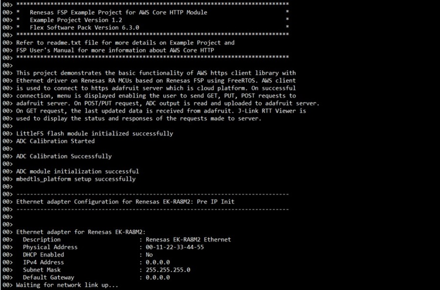

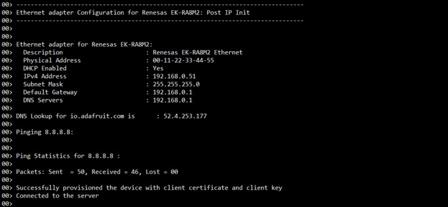

**Note**: After the initial successful connection, the user should run the POST request first and then the GET request prior to running the PUT request.

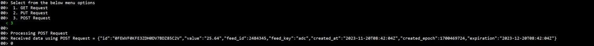

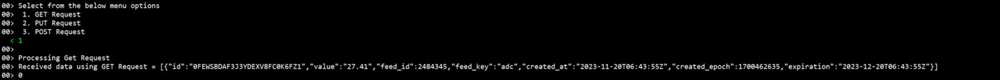

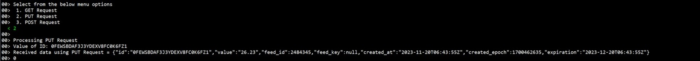

The image below shows the adafruit server with feed data:

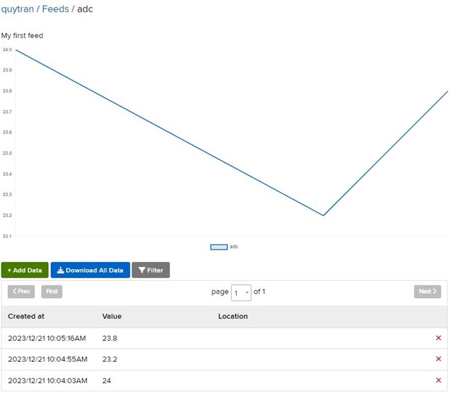

## Special Topics ##

**I. Obtaining Adafruit server credentials**:

Following steps guide you how to obtain the username and AIO key.

1. Go to https://io.adafruit.com. Click on **Get Started for Free** option as shown in the image below

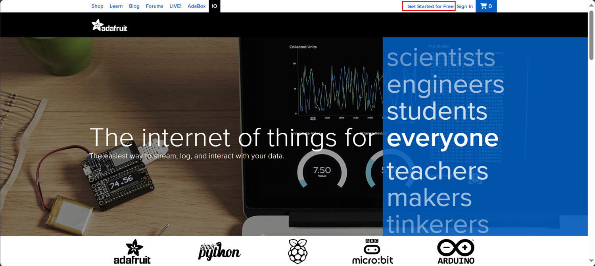

2. Create an account by providing the requested details to obtain user credintails viz., **username** and **password** 
3. After successful creation of account, username will display on top of the page as shown in the image below. Click on **IO**, dashboard will display with the following options **Feeds, Dashboards, Key** etc.

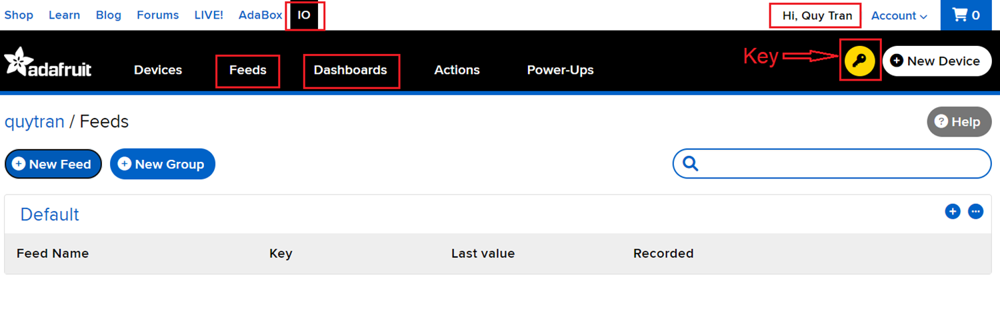
 
4. Click on **New Feed**, provide Name, Description (optional) then click on **Create** to create a new feed.

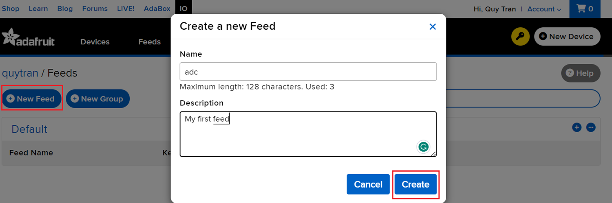

5. After creating the feed, select the feed you have created, and your data will be displayed below.

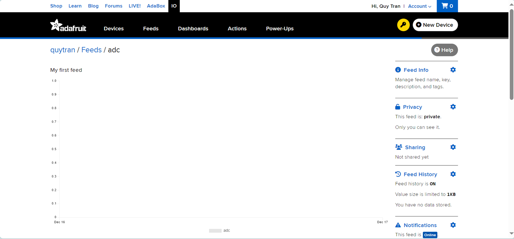

6. Then you should to set Privacy to **Public**. Click on **Privacy**, change **Visibility** to **Public**, then click on **Create**.

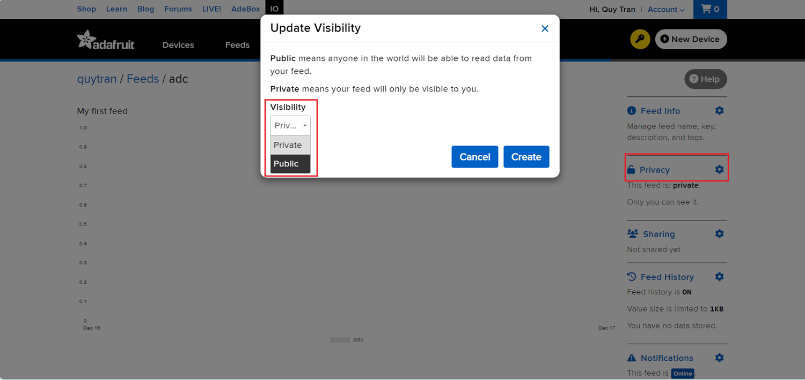

7. Click on **Key** button option to see your username and Active key. These two details are important for communicating with adafruit server. If the key is compromised, you can generate the new key by clicking on the Regenerate key option as shown in the image below.

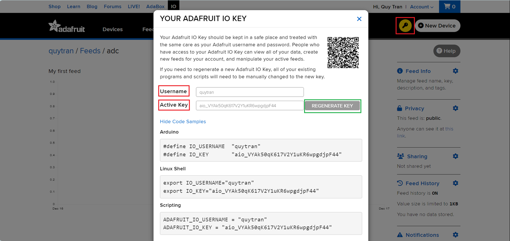 
 
8. After obtaining the username and io key. The user has to update the following details at respective URL macros in the aws_https_client_ep/src/user_app.h file as shown in the image below.
Please note that the Key will be changed after a period of time, please update and use the latest key.

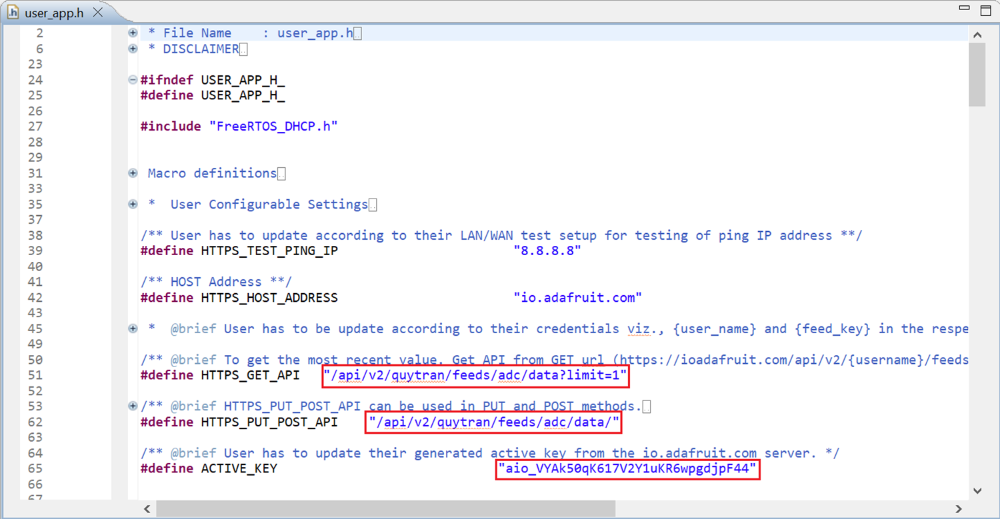

**II. Obtaining Server Certificate:**

1. Open browser, copy, and paste the following URL https://cacerts.digicert.com/GeoTrustTLSRSACAG1.crt. Server certificate with .crt extension will be downloaded with the file name **GeoTrustTLSRSACAG1.crt**

2. After downloaded the .crt file, need to be converted to .pem format using OpenSSL.

3. OpenSSL can be downloaded from https://www.openssl.org/source/. depend on the Operating System, required installer can be downloaded and installed.

    For Windows users, OpenSSL can be downloaded from https://slproweb.com/products/Win32OpenSSL.html.

4. Copy the downloaded certificate to the bin folder of your installed OpenSSL.

5. Open the cmd prompt in Administrator mode from the bin folder of your installed OpenSSL as shown in the image below.

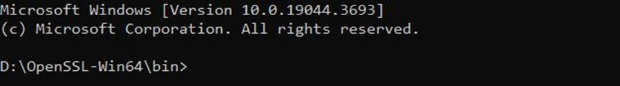

6. Type the conversion command: **openssl.exe x509 -inform DER -outform PEM -in GeoTrustTLSRSACAG1.crt -out GeoTrustTLSRSACAG1.crt.pem** as shown in the image below.
 
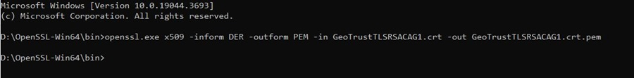
 
7. **GeoTrustTLSRSACAG1.crt.pem** file will be generated in your bin folder as shown in the image below.
 
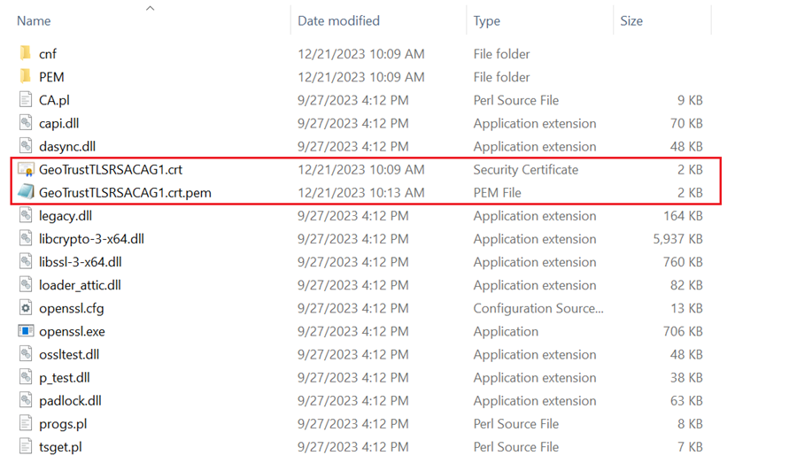

8. Open the converted certificate file with notepad and copy the content and update in the aws_https_client_ep\src\usr_app.h file at the **HTTPS_TRUSTED_ROOT_CA** macro as shown in the image below.

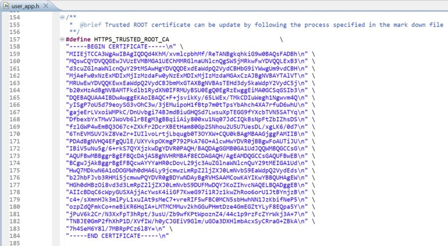

**III. Obtaining Client Certificate and Private Key:**

1. Open the cmd prompt from the bin folder of installed Openssl. 

2. To generate the private key and CSR certificate use the command **openssl req -newkey rsa:2048 -nodes -keyout clientside.key -x509 -days 365 -out clientside.crt** as shown below.
**NOTE:** Output file can be any name.

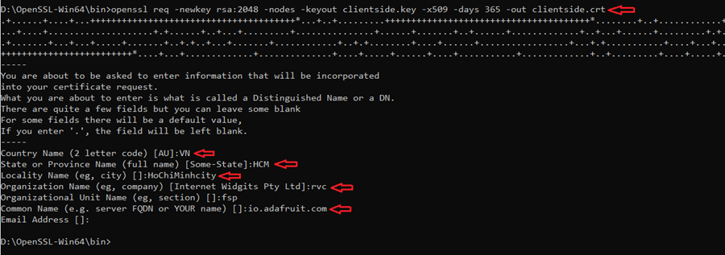

3. **clientside.key** and **clientside.crt** files are generated in binary folder. Verify client certificate is properly generated by using command **openssl x509 -text -noout -in clientside.crt** as shown below.

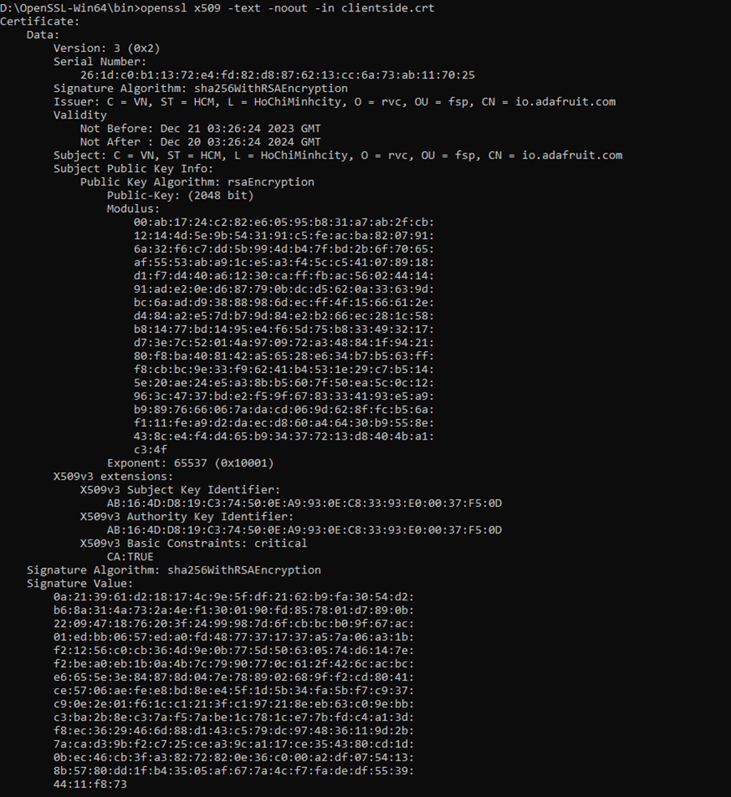

4. Generated client certificate is in .crt format. It has to be converted to .pem format. Conversion can be done from .crt to .der and then .der to .pem. 
To convert from .crt to .der, Use the command **openssl x509 -in clientside.crt -outform der -out clientside.der** as shown below.

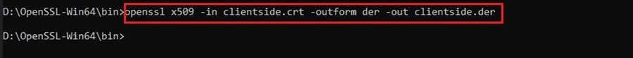

5. To convert .der to .pem use the command **openssl x509 -inform der -in clientside.der -out clientside.pem** as shown below.

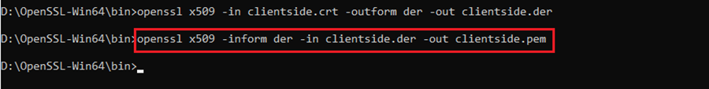

6. The generated files can be found in bin folder of OpenSSL installed software as shown in the image below.

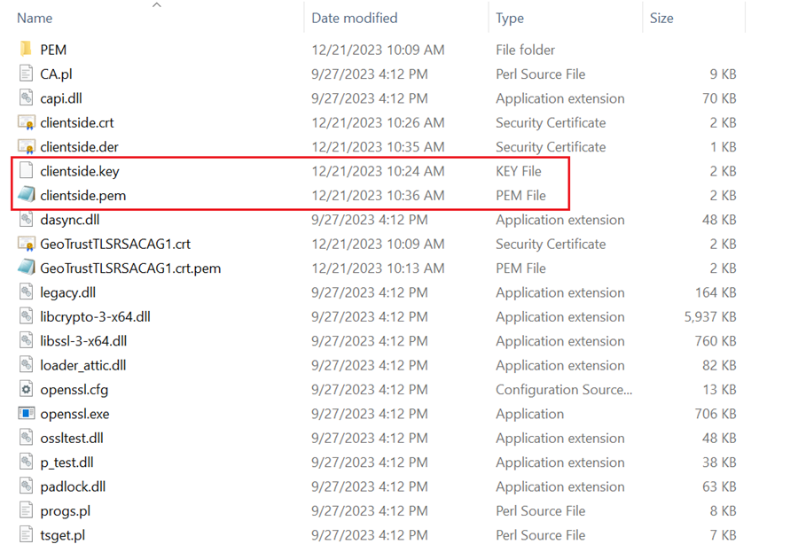

7. Open the generated files in notepad and copy the content and paste in the aws_https_client_ep/src/usr_app.h 

i. Copied client certificate form to be updated at the CLIENT_CERTIFICATE_PEM macro as shown in the image below.

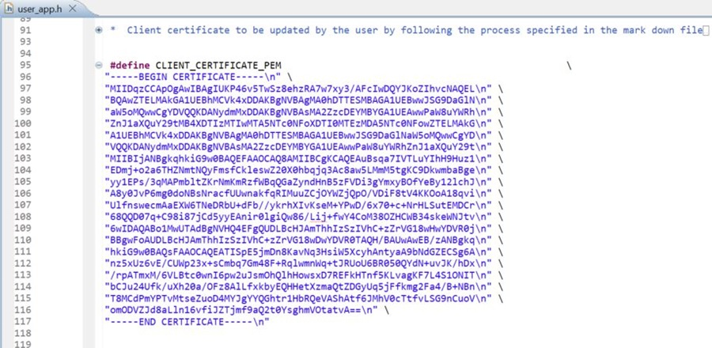

ii. Copied client key to be updated at the CLIENT_KEY_PEM macro as shown in the image below.

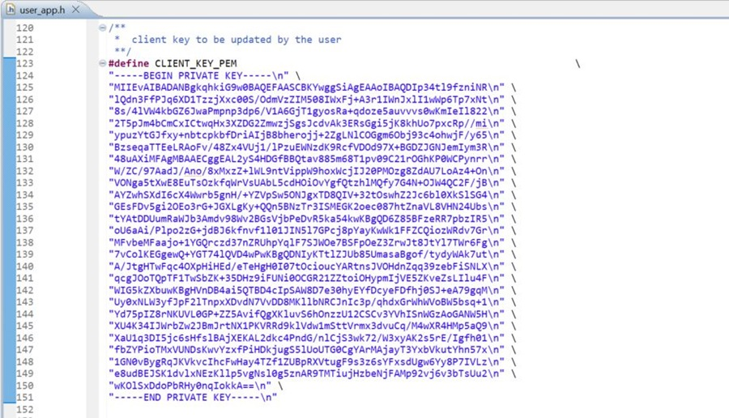

**NOTE:** Client Certificate and client Key are required for AWS Client application to authenticate server in secure connection. If missing of both, then it cannot be connected to server instead return an error as no certificates were found.
