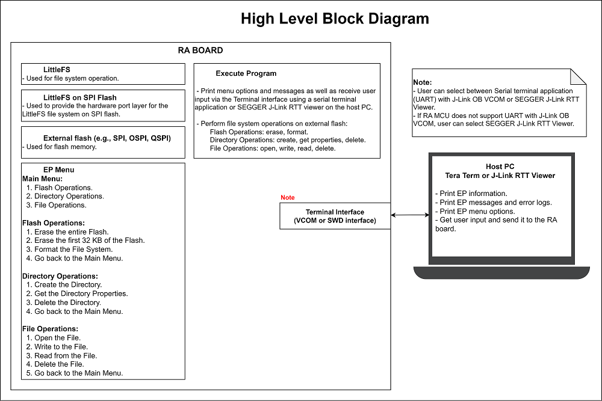
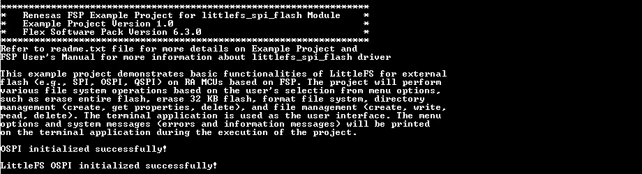
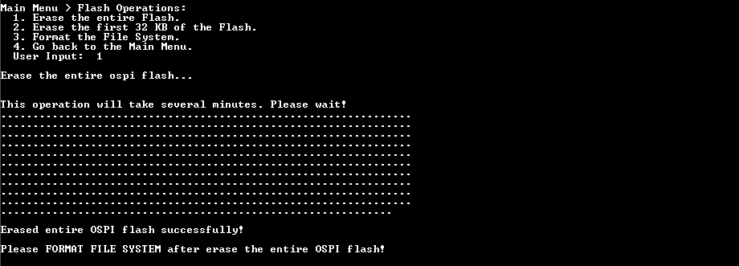
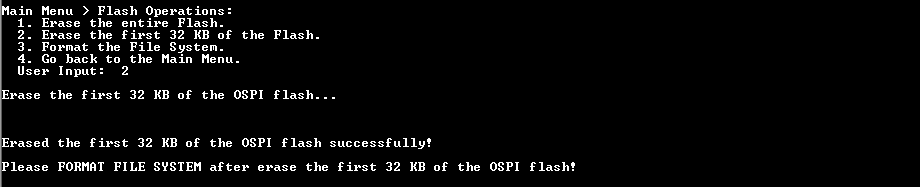
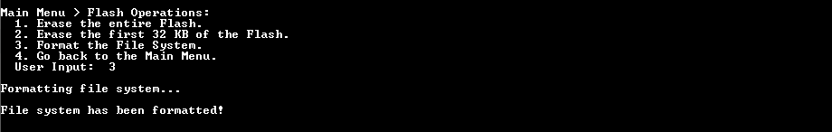
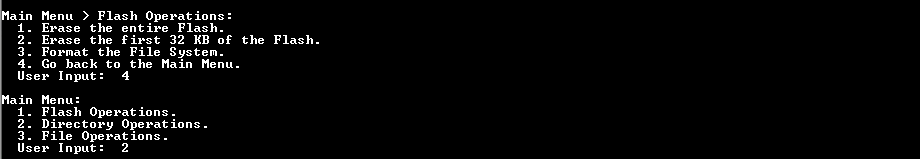
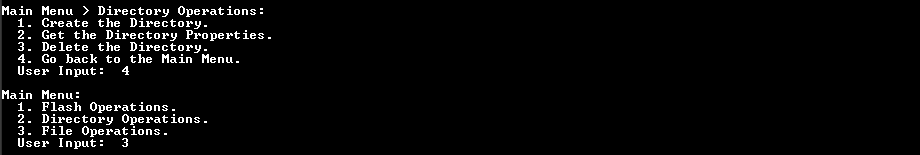
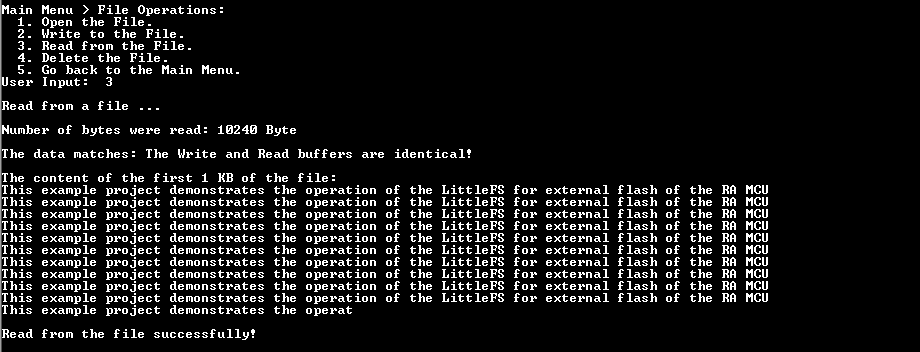

# Introduction #
This example project demonstrates basic functionalities of LittleFS for external flash (e.g., SPI, OSPI, QSPI) on RA MCU based on FSP. The project will perform various file system operations based on the user's selection from menu options, such as erase entire flash, erase 32 KB flash, format file system, directory management (create, get properties, delete), and file management (create, write, read, delete). The terminal application is used as the user interface. The menu options and system messages (errors and information messages) will be printed on the terminal application during the execution of the project.

**Note:**
- To display information, users can choose between the SEGGER J-Link RTT Viewer and the serial terminal (UART) with J-Link OB VCOM. It is important to note that the user should only operate a single terminal application at a time to avoid conflicts or data inconsistencies. 
- For instructions on how to switch between these options, please refer to the **[Verifying Operation](#verifying-operation)** section in this file.
- By default, EP information is printed to the host PC using the serial terminal for boards that support J-Link OB VCOM. Vice versa, for the RA boards that do not support J-Link OB VCOM, EP uses the SEGGER J-Link RTT Viewer by default instead.
- RA boards supported for J-Link OB VCOM: EK-RA8D1, EK-RA8M2.

In the Main Menu, the user selects a sub menu such as Flash Operations Menu, Directory Operations Menu, File Operations Menu.
1. Flash Operations.
2. Directory Operations.
3. File Operations.

In the Flash Operations Menu, the user selects operation to perform.
1. Erase the entire Flash.
2. Erase the first 32 KB of the Flash.
3. Format the File System.
4. Go back to the Main Menu.

In the Directory Operations Menu, the user selects operation to perform.
1. Create the Directory.
2. Get the Directory Properties.
3. Delete the Directory.
4. Go back to the Main Menu.

In the File Operations Menu, the user selects operation to perform.
1. Open the File.
2. Write to the File.
3. Read from the File.
4. Delete the File.
5. Go back to the Main Menu.

Please refer to the [Example Project Usage Guide](https://github.com/renesas/ra-fsp-examples/blob/master/example_projects/Example%20Project%20Usage%20Guide.pdf) for general information on example projects and [readme.txt](./readme.txt) for specifics of operation.

## Required Resources ## 
The following resources are needed to build and run the littlefs_ospi_b example project.

### Hardware ###
Supported RA boards: EK-RA8D1, EK-RA8M2.
* 1 x Renesas RA board.
* 1 x USB cable for programming and debugging.

### Hardware Connections  ###
* Connect the USB Debug port on the RA board to the host PC via a USB cable.
* For EK-RA8M2:
	* The user must place jumper J6 on pins 2-3, J8 on pins 1-2, J9 on pins 2-3, and J29 on pins 1-2, 3-4, 5-6, 7-8 to use the on-board debug functionality.

### Software ###
* Renesas Flexible Software Package (FSP): Version 6.4.0
* e2 studio: Version 2025-12
* SEGGER J-Link RTT Viewer: Version 9.14a
* LLVM Embedded Toolchain for ARM: Version 21.1.1
* Terminal Console Application: Tera Term or a similar application

Refer to the software required section in [Example Project Usage Guide](https://github.com/renesas/ra-fsp-examples/blob/master/example_projects/Example%20Project%20Usage%20Guide.pdf)

## Related Collateral References ##
The following documents can be referred to for enhancing your understanding of the operation of this example project:
- [FSP User Manual on GitHub](https://renesas.github.io/fsp/)
- [FSP Known Issues](https://github.com/renesas/fsp/issues)

# Project Notes #

## System Level Block Diagram ##
 High level block diagram of the system is as shown below:
 

## FSP Modules Used ##
List all the various modules that are used in this example project. Refer to the FSP User Manual for further details on each module listed below.

| Module Name | Usage | Searchable Keyword  |
|-------------|-----------------------------------------------|-----------------------------------------------|
| LittleFS | LittleFS is used for file system operation. | LittleFS |
| LittleFS on SPI Flash | This module provides the hardware port layer for the LittleFS file system on SPI flash memory. | rm_littlefs_spi_flash |
| OSPI Flash | OSPI_B is used to configure flash device and perform write, read, or erase operations on flash device's memory array. | r_ospi_b |
| DMAC | DMAC is used to write data to OSPI_B flash and read back to verification without CPU. | r_dmac |

**Note:**
* Blocking Read/Write/Erase:  
  The LittleFS port blocks on Read/Write/Erase calls until the operation has completed.
* Memory Constraints:  
  The block size defined in the LittleFS configuration must be a multiple of the data flash erase size of the MCU. It must be greater than 104 bytes which is the minimum block size of a LittleFS block. 

## Module Configuration Notes ##
This section describes FSP configuration properties that are important or different from those selected by default.

**Configuration Properties for using LittleFS**

|   Module Property Path and Identifier   |   Default Value   |   Used Value   |   Reason   |
|-----------------------------------------|-------------------|----------------|------------|
| configuration.xml > Stacks > LittleFS > Properties > Settings > Property > Common > Use Malloc | Enabled | Enabled | Enable to use malloc with LittleFS. |
| configuration.xml > BSP > Properties > Settings > Property > RA Common > Heap size (bytes) | 0 | 0x1000 | A heap size is required to use malloc with LittleFS. |
| configuration.xml > BSP > Properties > Settings > Property > RA Common > Main stack size (bytes) | 0x400 | 0x1200 | Set the size of the main program stack. |

**Configuration without using malloc**
|   Module Property Path and Identifier   |   Default Value   |   Used Value   |   Reason   |
|-----------------------------------------|-------------------|----------------|------------|
| configuration.xml > Stacks > LittleFS > Properties > Settings > Property > Common > Use Malloc | Enabled | Disabled | Disable to not use malloc with LittleFS. |
| configuration.xml > BSP > Properties > Settings > Property > RA Common > Heap size (bytes) | 0 | 0 | The main heap size is disabled by default. |
| configuration.xml > BSP > Properties > Settings > Property > RA Common > Main stack size (bytes) | 0x400 | 0x1200 | Set the size of the main program stack. |

**Enable Data cache in BSP Configuration**
|   Module Property Path and Identifier   |   Default Value   |   Used Value   |   Reason   |
|-----------------------------------------|-------------------|----------------|------------|
| configuration.xml > BSP > Properties > Settings > Property > RA8M2 Family > Cache settings > Data cache | Disabled | Enabled | Enable Data cache to improve performance. |

**Configuration Properties for using LittleFS on SPI Flash**

|   Module Property Path and Identifier   |   Default Value   |   Used Value   |   Reason   |
|-----------------------------------------|-------------------|----------------|------------|
| configuration.xml > Stacks > LittleFS on SPI Flash (rm_littlefs_spi_flash) > Properties > Settings > Property > Module LittleFS on SPI Flash (rm_littlefs_spi_flash) > Read Size | 1 | 1 | Minimum size of a block read. |
| configuration.xml > Stacks > LittleFS on SPI Flash (rm_littlefs_spi_flash) > Properties > Settings > Property > Module LittleFS on SPI Flash (rm_littlefs_spi_flash) > Program Size | 4 | 4 | Minimum size of a block program. |
| configuration.xml > Stacks > LittleFS on SPI Flash (rm_littlefs_spi_flash) > Properties > Settings > Property > Module LittleFS on SPI Flash (rm_littlefs_spi_flash) > Block Size (bytes) | 4096 | 4096 | Size of an erasable block. |
| configuration.xml > Stacks > LittleFS on SPI Flash (rm_littlefs_spi_flash) > Properties > Settings > Property > Module LittleFS on SPI Flash (rm_littlefs_spi_flash) > Block Cycles | 1024 | 1024 | Number of erase cycles before LittleFS evicts metadata logs and moves the metadata to another block. |
| configuration.xml > Stacks > LittleFS on SPI Flash (rm_littlefs_spi_flash) > Properties > Settings > Property > Module LittleFS on SPI Flash (rm_littlefs_spi_flash) > Cache Size | 64 | 64 | Size of block caches. |
| configuration.xml > Stacks > LittleFS on SPI Flash (rm_littlefs_spi_flash) > Properties > Settings > Property > Module LittleFS on SPI Flash (rm_littlefs_spi_flash) > Lookahead Size | 16 | 16 | Size of the lookahead buffer in bytes. |
| configuration.xml > Stacks > LittleFS on SPI Flash (rm_littlefs_spi_flash) > Properties > Settings > Property > Module LittleFS on SPI Flash (rm_littlefs_spi_flash) > Memory Size (bytes) | 33554432 | 0x20000 | Set the size that LittleFS Memory should be used. |

**Configuration Properties for using OSPI Flash (For LittleFS Instance)**

|   Module Property Path and Identifier   |   Default Value   |   Used Value   |   Reason   |
|-----------------------------------------|-------------------|----------------|------------|
| configuration.xml > Stacks > LittleFS > g_ospi_b_littlefs OSPI Flash (r_ospi_b) > Properties > Settings > Property > Common > DMAC Support | Disable | Enable | Enable DMAC support for the OSPI module. |
| configuration.xml > Stacks > LittleFS > g_ospi_b_littlefs OSPI Flash (r_ospi_b) > Properties > Settings > Property > Common > Autocalibration Support | Disable | Enable | Enable DS autocalibration for dual-data-rate modes. |
| configuration.xml > Stacks > LittleFS > g_ospi_b_littlefs OSPI Flash (r_ospi_b) > Properties > Settings > Property > Module g_ospi_b_littlefs OSPI Flash (r_ospi_b) > General > Name | g_ospi | g_ospi_b_littlefs | Module name. |
| configuration.xml > Stacks > LittleFS > g_ospi_b_littlefs OSPI Flash (r_ospi_b) > Properties > Settings > Property > Module g_ospi_b_littlefs OSPI Flash (r_ospi_b) > General > Unit | OSPI_B0 | OSPI_B0 | Specify the OSPI peripheral to use. |
| configuration.xml > Stacks > LittleFS > g_ospi_b_littlefs OSPI Flash (r_ospi_b) > Properties > Settings > Property > Module g_ospi_b_littlefs OSPI Flash (r_ospi_b) > General > Chip Select | CS1 | CS1 | Specify the OSPI chip select line to use. |
| configuration.xml > Stacks > LittleFS > g_ospi_b_littlefs OSPI Flash (r_ospi_b) > Properties > Settings > Property > Module g_ospi_b_littlefs OSPI Flash (r_ospi_b) > General > Write Status Bit | b0 | b0 | Position of the status bit in the flash device register. |
| configuration.xml > Stacks > LittleFS > g_ospi_b_littlefs OSPI Flash (r_ospi_b) > Properties > Settings > Property > Module g_ospi_b_littlefs OSPI Flash (r_ospi_b) > General > Write Enable Bit | b1 | b1 | Position of the write enable bit in the flash device register. |
| configuration.xml > Stacks > LittleFS > g_ospi_b_littlefs OSPI Flash (r_ospi_b) > Properties > Settings > Property > Module g_ospi_b_littlefs OSPI Flash (r_ospi_b) > General > DS Auto-calibration Pattern Address | 0 | 0x9001F000 | Address to the auto-calibration pattern in the target flash memory's address space. |
| configuration.xml > Stacks > LittleFS > g_ospi_b_littlefs OSPI Flash (r_ospi_b) > Properties > Settings > Property > Module g_ospi_b_littlefs OSPI Flash (r_ospi_b) > Command Sets > Erase Sizes > Sector Erase | 4096 | 4096 | Size of memory region erased by Sector Erase. |
| configuration.xml > Stacks > LittleFS > g_ospi_b_littlefs OSPI Flash (r_ospi_b) > Properties > Settings > Property > Module g_ospi_b_littlefs OSPI Flash (r_ospi_b) > Command Sets > Erase Sizes > Block Erase | 262144 | 65536 | Size of memory region erased by Block Erase. |
| configuration.xml > Stacks > LittleFS > g_ospi_b_littlefs OSPI Flash (r_ospi_b) > Properties > Settings > Property > Module g_ospi_b_littlefs OSPI Flash (r_ospi_b) > Command Sets > Initial Mode > Protocol Mode | SPI (1S-1S-1S) | Dual data rate OPI (8D-8D-8D) | Select Dual data rate OPI (8D-8D-8D) as the initial protocol mode. |
| configuration.xml > Stacks > LittleFS > g_ospi_b_littlefs OSPI Flash (r_ospi_b) > Properties > Settings > Property > Module g_ospi_b_littlefs OSPI Flash (r_ospi_b) > Command Sets > Initial Mode > Frame Format | Standard | xSPI Profile 1.0 | Select the frame format to use with this command set. |
| configuration.xml > Stacks > LittleFS > g_ospi_b_littlefs OSPI Flash (r_ospi_b) > Properties > Settings > Property > Module g_ospi_b_littlefs OSPI Flash (r_ospi_b) > Command Sets > Initial Mode > Address Length | 3 bytes | 4 bytes | Select number of bytes used to address data in a memory page or row. |
| configuration.xml > Stacks > LittleFS > g_ospi_b_littlefs OSPI Flash (r_ospi_b) > Properties > Settings > Property > Module g_ospi_b_littlefs OSPI Flash (r_ospi_b) > Command Sets > Initial Mode > Command Code Length | 1 byte | 2 bytes | Select number of bytes used for command codes. |
| configuration.xml > Stacks > LittleFS > g_ospi_b_littlefs OSPI Flash (r_ospi_b) > Properties > Settings > Property > Module g_ospi_b_littlefs OSPI Flash (r_ospi_b) > Command Sets > Initial Mode > Status Register | No address | 4 bytes | Select number of bytes used for addressing the status register. |
| configuration.xml > Stacks > LittleFS > g_ospi_b_littlefs OSPI Flash (r_ospi_b) > Properties > Settings > Property > Module g_ospi_b_littlefs OSPI Flash (r_ospi_b) > Command Sets > Initial Mode > Read > Command Code | 0x13 | 0xEE11 | Read command code of flash device in Dual data rate OPI (8D-8D-8D) mode. |
| configuration.xml > Stacks > LittleFS > g_ospi_b_littlefs OSPI Flash (r_ospi_b) > Properties > Settings > Property > Module g_ospi_b_littlefs OSPI Flash (r_ospi_b) > Command Sets > Initial Mode > Read > Dummy Cycles | 0 | 10 | Dummy cycles to use between the address and data phase for Read commands. |
| configuration.xml > Stacks > LittleFS > g_ospi_b_littlefs OSPI Flash (r_ospi_b) > Properties > Settings > Property > Module g_ospi_b_littlefs OSPI Flash (r_ospi_b) > Command Sets > Initial Mode > Program > Command Code | 0x12 | 0x12ED | Program command code of flash device in Dual data rate OPI (8D-8D-8D) mode. |
| configuration.xml > Stacks > LittleFS > g_ospi_b_littlefs OSPI Flash (r_ospi_b) > Properties > Settings > Property > Module g_ospi_b_littlefs OSPI Flash (r_ospi_b) > Command Sets > Initial Mode > Write Enable > Command Code | 0x06 | 0x06F9 | Write Enable command code of flash device in Dual data rate OPI (8D-8D-8D) mode. |
| configuration.xml > Stacks > LittleFS > g_ospi_b_littlefs OSPI Flash (r_ospi_b) > Properties > Settings > Property > Module g_ospi_b_littlefs OSPI Flash (r_ospi_b) > Command Sets > Initial Mode > Status Read > Command Code | 0x05 | 0x05FA | Status Read command code of flash device in Dual data rate OPI (8D-8D-8D) mode. |
| configuration.xml > Stacks > LittleFS > g_ospi_b_littlefs OSPI Flash (r_ospi_b) > Properties > Settings > Property > Module g_ospi_b_littlefs OSPI Flash (r_ospi_b) > Command Sets > Initial Mode > Status Read > Dummy Cycles | 0 | 4 | Dummy cycles to use between the address and data phase for Status Read commands. |
| configuration.xml > Stacks > LittleFS > g_ospi_b_littlefs OSPI Flash (r_ospi_b) > Properties > Settings > Property > Module g_ospi_b_littlefs OSPI Flash (r_ospi_b) > Command Sets > Initial Mode > Sector Erase > Command Code | 0x21 | 0x21DE | Sector Erase command code of flash device in Dual data rate OPI (8D-8D-8D) mode. |
| configuration.xml > Stacks > LittleFS > g_ospi_b_littlefs OSPI Flash (r_ospi_b) > Properties > Settings > Property > Module g_ospi_b_littlefs OSPI Flash (r_ospi_b) > Command Sets > Initial Mode > Block Erase > Command Code | 0xDC | 0xDC23 | Block Erase command code of flash device in Dual data rate OPI (8D-8D-8D) mode. |
| configuration.xml > Stacks > LittleFS > g_ospi_b_littlefs OSPI Flash (r_ospi_b) > Properties > Settings > Property > Module g_ospi_b_littlefs OSPI Flash (r_ospi_b) > Command Sets > Initial Mode > Chip Erase > Command Code | 0x60 | 0x609F | Chip Erase command code of flash device in Dual data rate OPI (8D-8D-8D) mode. |
| configuration.xml > Stacks > LittleFS > g_ospi_b_littlefs OSPI Flash (r_ospi_b) > Properties > Settings > Property > Module g_ospi_b_littlefs OSPI Flash (r_ospi_b) > Command Sets > High-speed Mode > Protocol Mode | Dual data rate OPI (8D-8D-8D) | Dual data rate OPI (8D-8D-8D) | Select Dual data rate OPI (8D-8D-8D) mode. |
| configuration.xml > Stacks > LittleFS > g_ospi_b_littlefs OSPI Flash (r_ospi_b) > Properties > Settings > Property > Module g_ospi_b_littlefs OSPI Flash (r_ospi_b) > Command Sets > High-speed Mode > Frame Format | xSPI Profile 1.0 | xSPI Profile 1.0  | Select the frame format to use with this command set. |
| configuration.xml > Stacks > LittleFS > g_ospi_b_littlefs OSPI Flash (r_ospi_b) > Properties > Settings > Property > Module g_ospi_b_littlefs OSPI Flash (r_ospi_b) > Command Sets > High-speed Mode > Address Length | 4 bytes | 4 bytes | Select number of bytes used to address data in a memory page or row. |
| configuration.xml > Stacks > LittleFS > g_ospi_b_littlefs OSPI Flash (r_ospi_b) > Properties > Settings > Property > Module g_ospi_b_littlefs OSPI Flash (r_ospi_b) > Command Sets > High-speed Mode > Command Code Length | 2 bytes | 2 bytes | Select number of bytes used for command codes. |
| configuration.xml > Stacks > LittleFS > g_ospi_b_littlefs OSPI Flash (r_ospi_b) > Properties > Settings > Property > Module g_ospi_b_littlefs OSPI Flash (r_ospi_b) > Command Sets > High-speed Mode > Read > Command Code | 0xEEEE | 0xEE11 | Read command code of flash device in Dual data rate OPI (8D-8D-8D) mode. |
| configuration.xml > Stacks > LittleFS > g_ospi_b_littlefs OSPI Flash (r_ospi_b) > Properties > Settings > Property > Module g_ospi_b_littlefs OSPI Flash (r_ospi_b) > Command Sets > High-speed Mode > Read > Dummy Cycles | 20 | 10 | Dummy cycles to use between the address and data phase for Read commands. |
| configuration.xml > Stacks > LittleFS > g_ospi_b_littlefs OSPI Flash (r_ospi_b) > Properties > Settings > Property > Module g_ospi_b_littlefs OSPI Flash (r_ospi_b) > Command Sets > High-speed Mode > Program > Command Code | 0x1212 | 0x12ED | Program command code of flash device in Dual data rate OPI (8D-8D-8D) mode. |
| configuration.xml > Stacks > LittleFS > g_ospi_b_littlefs OSPI Flash (r_ospi_b) > Properties > Settings > Property > Module g_ospi_b_littlefs OSPI Flash (r_ospi_b) > Command Sets > High-speed Mode > Write Enable > Command Code | 0x0606 | 0x06F9 | Write Enable command code of flash device in Dual data rate OPI (8D-8D-8D) mode. |
| configuration.xml > Stacks > LittleFS > g_ospi_b_littlefs OSPI Flash (r_ospi_b) > Properties > Settings > Property > Module g_ospi_b_littlefs OSPI Flash (r_ospi_b) > Command Sets > High-speed Mode > Status Read > Command Code | 0x0505 | 0x05FA | Status Read command code of flash device in Dual data rate OPI (8D-8D-8D) mode. |
| configuration.xml > Stacks > LittleFS > g_ospi_b_littlefs OSPI Flash (r_ospi_b) > Properties > Settings > Property > Module g_ospi_b_littlefs OSPI Flash (r_ospi_b) > Command Sets > High-speed Mode > Status Read > Dummy Cycles | 3 | 4 | Dummy cycles to use between the address and data phase for Status Read commands. |
| configuration.xml > Stacks > LittleFS > g_ospi_b_littlefs OSPI Flash (r_ospi_b) > Properties > Settings > Property > Module g_ospi_b_littlefs OSPI Flash (r_ospi_b) > Command Sets > High-speed Mode > Sector Erase > Command Code | 0x2121 | 0x21DE | Sector Erase command code of flash device in Dual data rate OPI (8D-8D-8D) mode. |
| configuration.xml > Stacks > LittleFS > g_ospi_b_littlefs OSPI Flash (r_ospi_b) > Properties > Settings > Property > Module g_ospi_b_littlefs OSPI Flash (r_ospi_b) > Command Sets > High-speed Mode > Block Erase > Command Code | 0xDCDC | 0xDC23 | Block Erase command code of flash device in Dual data rate OPI (8D-8D-8D) mode. |
| configuration.xml > Stacks > LittleFS > g_ospi_b_littlefs OSPI Flash (r_ospi_b) > Properties > Settings > Property > Module g_ospi_b_littlefs OSPI Flash (r_ospi_b) > Command Sets > High-speed Mode > Chip Erase > Command Code | 0x6060 | 0x609F | Chip Erase command code of flash device in Dual data rate OPI (8D-8D-8D) mode. |

**Configuration Properties for using OSPI Flash (For Initialize Instance)**

|   Module Property Path and Identifier   |   Default Value   |   Used Value   |   Reason   |
|-----------------------------------------|-------------------|----------------|------------|
| configuration.xml > Stacks > g_ospi_b_init OSPI Flash (r_ospi_b) > Properties > Settings > Property > Common > DMAC Support | Disable | Enable | Enable DMAC support for the OSPI module. |
| configuration.xml > Stacks > g_ospi_b_init OSPI Flash (r_ospi_b) > Properties > Settings > Property > Common > Autocalibration Support | Disable | Enable | Enable DS autocalibration for dual-data-rate modes. |
| configuration.xml > Stacks > g_ospi_b_init OSPI Flash (r_ospi_b) > Properties > Settings > Property > Module g_ospi_b_init OSPI Flash (r_ospi_b) > General > Name | g_ospi | g_ospi_b_init | Module name. |
| configuration.xml > Stacks > g_ospi_b_init OSPI Flash (r_ospi_b) > Properties > Settings > Property > Module g_ospi_b_init OSPI Flash (r_ospi_b) > General > Unit | OSPI_B0 | OSPI_B0 | Specify the OSPI peripheral to use. |
| configuration.xml > Stacks > g_ospi_b_init OSPI Flash (r_ospi_b) > Properties > Settings > Property > Module g_ospi_b_init OSPI Flash (r_ospi_b) > General > Chip Select | CS1 | CS1 | Specify the OSPI chip select line to use. |
| configuration.xml > Stacks > g_ospi_b_init OSPI Flash (r_ospi_b) > Properties > Settings > Property > Module g_ospi_b_init OSPI Flash (r_ospi_b) > General > Write Status Bit | b0 | b0 | Position of the status bit in the flash device register. |
| configuration.xml > Stacks > g_ospi_b_init OSPI Flash (r_ospi_b) > Properties > Settings > Property > Module g_ospi_b_init OSPI Flash (r_ospi_b) > General > Write Enable Bit | b1 | b1 | Position of the write enable bit in the flash device register. |
| configuration.xml > Stacks > g_ospi_b_init OSPI Flash (r_ospi_b) > Properties > Settings > Property > Module g_ospi_b_init OSPI Flash (r_ospi_b) > General > DS Auto-calibration Pattern Address | 0 | 0x9001F000 | Address to the auto-calibration pattern in the target flash memory's address space. |
| configuration.xml > Stacks > g_ospi_b_init OSPI Flash (r_ospi_b) > Properties > Settings > Property > Module g_ospi_b_init OSPI Flash (r_ospi_b) > Command Sets > Erase Sizes > Sector Erase | 4096 | 4096 | Size of memory region erased by Sector Erase. |
| configuration.xml > Stacks > g_ospi_b_init OSPI Flash (r_ospi_b) > Properties > Settings > Property > Module g_ospi_b_init OSPI Flash (r_ospi_b) > Command Sets > Erase Sizes > Block Erase | 262144 | 65536 | Size of memory region erased by Block Erase. |
| configuration.xml > Stacks > g_ospi_b_init OSPI Flash (r_ospi_b) > Properties > Settings > Property > Module g_ospi_b_init OSPI Flash (r_ospi_b) > Command Sets > Initial Mode > Protocol Mode | SPI (1S-1S-1S) | SPI (1S-1S-1S) | Select SPI (1S-1S-1S) as the initial protocol mode. |
| configuration.xml > Stacks > g_ospi_b_init OSPI Flash (r_ospi_b) > Properties > Settings > Property > Module g_ospi_b_init OSPI Flash (r_ospi_b) > Command Sets > Initial Mode > Frame Format | Standard | Standard | Select the frame format to use with this command set. |
| configuration.xml > Stacks > g_ospi_b_init OSPI Flash (r_ospi_b) > Properties > Settings > Property > Module g_ospi_b_init OSPI Flash (r_ospi_b) > Command Sets > Initial Mode > Address Length | 3 bytes | 4 bytes | Select number of bytes used to address data in a memory page or row. |
| configuration.xml > Stacks > g_ospi_b_init OSPI Flash (r_ospi_b) > Properties > Settings > Property > Module g_ospi_b_init OSPI Flash (r_ospi_b) > Command Sets > Initial Mode > Command Code Length | 1 byte | 1 byte | Select number of bytes used for command codes. |
| configuration.xml > Stacks > g_ospi_b_init OSPI Flash (r_ospi_b) > Properties > Settings > Property > Module g_ospi_b_init OSPI Flash (r_ospi_b) > Command Sets > Initial Mode > Status Register | No address | No address | Select number of bytes used for addressing the status register. |
| configuration.xml > Stacks > g_ospi_b_init OSPI Flash (r_ospi_b) > Properties > Settings > Property > Module g_ospi_b_init OSPI Flash (r_ospi_b) > Command Sets > Initial Mode > Read > Command Code | 0x13 | 0x0C | Read command code of flash device in SPI (1S-1S-1S) mode. |
| configuration.xml > Stacks > g_ospi_b_init OSPI Flash (r_ospi_b) > Properties > Settings > Property > Module g_ospi_b_init OSPI Flash (r_ospi_b) > Command Sets > Initial Mode > Read > Dummy Cycles | 0 | 8 | Dummy cycles to use between the address and data phase for Read commands. |
| configuration.xml > Stacks > g_ospi_b_init OSPI Flash (r_ospi_b) > Properties > Settings > Property > Module g_ospi_b_init OSPI Flash (r_ospi_b) > Command Sets > Initial Mode > Program > Command Code | 0x12 | 0x12 | Program command code of flash device in SPI (1S-1S-1S) mode. |
| configuration.xml > Stacks > g_ospi_b_init OSPI Flash (r_ospi_b) > Properties > Settings > Property > Module g_ospi_b_init OSPI Flash (r_ospi_b) > Command Sets > Initial Mode > Write Enable > Command Code | 0x06 | 0x06 | Write Enable command code of flash device in SPI (1S-1S-1S) mode. |
| configuration.xml > Stacks > g_ospi_b_init OSPI Flash (r_ospi_b) > Properties > Settings > Property > Module g_ospi_b_init OSPI Flash (r_ospi_b) > Command Sets > Initial Mode > Status Read > Command Code | 0x05 | 0x05 | Status Read command code of flash device in SPI (1S-1S-1S) mode. |
| configuration.xml > Stacks > g_ospi_b_init OSPI Flash (r_ospi_b) > Properties > Settings > Property > Module g_ospi_b_init OSPI Flash (r_ospi_b) > Command Sets > Initial Mode > Status Read > Dummy Cycles | 0 | 0 | Dummy cycles to use between the address and data phase for Status Read commands. |
| configuration.xml > Stacks > g_ospi_b_init OSPI Flash (r_ospi_b) > Properties > Settings > Property > Module g_ospi_b_init OSPI Flash (r_ospi_b) > Command Sets > Initial Mode > Sector Erase > Command Code | 0x21 | 0x21 | Sector Erase command code of flash device in SPI (1S-1S-1S) mode. |
| configuration.xml > Stacks > g_ospi_b_init OSPI Flash (r_ospi_b) > Properties > Settings > Property > Module g_ospi_b_init OSPI Flash (r_ospi_b) > Command Sets > Initial Mode > Block Erase > Command Code | 0xDC | 0xDC | Block Erase command code of flash device in SPI (1S-1S-1S) mode. |
| configuration.xml > Stacks > g_ospi_b_init OSPI Flash (r_ospi_b) > Properties > Settings > Property > Module g_ospi_b_init OSPI Flash (r_ospi_b) > Command Sets > Initial Mode > Chip Erase > Command Code | 0x60 | 0x60 | Chip Erase command code of flash device in SPI (1S-1S-1S) mode. |
| configuration.xml > Stacks > g_ospi_b_init OSPI Flash (r_ospi_b) > Properties > Settings > Property > Module g_ospi_b_init OSPI Flash (r_ospi_b) > Command Sets > High-speed Mode > Protocol Mode | Dual data rate OPI (8D-8D-8D) | Dual data rate OPI (8D-8D-8D) | Select Dual data rate OPI (8D-8D-8D) mode. |
| configuration.xml > Stacks > g_ospi_b_init OSPI Flash (r_ospi_b) > Properties > Settings > Property > Module g_ospi_b_init OSPI Flash (r_ospi_b) > Command Sets > High-speed Mode > Frame Format | xSPI Profile 1.0 | xSPI Profile 1.0  | Select the frame format to use with this command set. |
| configuration.xml > Stacks > g_ospi_b_init OSPI Flash (r_ospi_b) > Properties > Settings > Property > Module g_ospi_b_init OSPI Flash (r_ospi_b) > Command Sets > High-speed Mode > Address Length | 4 bytes | 4 bytes | Select number of bytes used to address data in a memory page or row. |
| configuration.xml > Stacks > g_ospi_b_init OSPI Flash (r_ospi_b) > Properties > Settings > Property > Module g_ospi_b_init OSPI Flash (r_ospi_b) > Command Sets > High-speed Mode > Command Code Length | 2 bytes | 2 bytes | Select number of bytes used for command codes. |
| configuration.xml > Stacks > g_ospi_b_init OSPI Flash (r_ospi_b) > Properties > Settings > Property > Module g_ospi_b_init OSPI Flash (r_ospi_b) > Command Sets > High-speed Mode > Read > Command Code | 0xEEEE | 0xEE11 | Read command code of flash device in Dual data rate OPI (8D-8D-8D) mode. |
| configuration.xml > Stacks > g_ospi_b_init OSPI Flash (r_ospi_b) > Properties > Settings > Property > Module g_ospi_b_init OSPI Flash (r_ospi_b) > Command Sets > High-speed Mode > Read > Dummy Cycles | 20 | 10 | Dummy cycles to use between the address and data phase for Read commands. |
| configuration.xml > Stacks > g_ospi_b_init OSPI Flash (r_ospi_b) > Properties > Settings > Property > Module g_ospi_b_init OSPI Flash (r_ospi_b) > Command Sets > High-speed Mode > Program > Command Code | 0x1212 | 0x12ED | Program command code of flash device in Dual data rate OPI (8D-8D-8D) mode. |
| configuration.xml > Stacks > g_ospi_b_init OSPI Flash (r_ospi_b) > Properties > Settings > Property > Module g_ospi_b_init OSPI Flash (r_ospi_b) > Command Sets > High-speed Mode > Write Enable > Command Code | 0x0606 | 0x06F9 | Write Enable command code of flash device in Dual data rate OPI (8D-8D-8D) mode. |
| configuration.xml > Stacks > g_ospi_b_init OSPI Flash (r_ospi_b) > Properties > Settings > Property > Module g_ospi_b_init OSPI Flash (r_ospi_b) > Command Sets > High-speed Mode > Status Read > Command Code | 0x0505 | 0x05FA | Status Read command code of flash device in Dual data rate OPI (8D-8D-8D) mode. |
| configuration.xml > Stacks > g_ospi_b_init OSPI Flash (r_ospi_b) > Properties > Settings > Property > Module g_ospi_b_init OSPI Flash (r_ospi_b) > Command Sets > High-speed Mode > Status Read > Dummy Cycles | 3 | 4 | Dummy cycles to use between the address and data phase for Status Read commands. |
| configuration.xml > Stacks > g_ospi_b_init OSPI Flash (r_ospi_b) > Properties > Settings > Property > Module g_ospi_b_init OSPI Flash (r_ospi_b) > Command Sets > High-speed Mode > Sector Erase > Command Code | 0x2121 | 0x21DE | Sector Erase command code of flash device in Dual data rate OPI (8D-8D-8D) mode. |
| configuration.xml > Stacks > g_ospi_b_init OSPI Flash (r_ospi_b) > Properties > Settings > Property > Module g_ospi_b_init OSPI Flash (r_ospi_b) > Command Sets > High-speed Mode > Block Erase > Command Code | 0xDCDC | 0xDC23 | Block Erase command code of flash device in Dual data rate OPI (8D-8D-8D) mode. |
| configuration.xml > Stacks > g_ospi_b_init OSPI Flash (r_ospi_b) > Properties > Settings > Property > Module g_ospi_b_init OSPI Flash (r_ospi_b) > Command Sets > High-speed Mode > Chip Erase > Command Code | 0x6060 | 0x609F | Chip Erase command code of flash device in Dual data rate OPI (8D-8D-8D) mode. |

**Clock Configuration**
|   Configure Clock path   |   Default Value   |   Used Value   |   Reason   |
|--------------------------|-------------------|----------------|------------|
| configuration.xml > Clocks > Clocks Configuration > PLL Src:XTAL > PLL Div /3 | PLL Mul x250.00 | PLL Mul x120.00 | Select multiple for operating clock PLL. |
| configuration.xml > Clocks > Clocks Configuration > PLL Src:XTAL > PLL Div /3 > PLL Mul x120.00 > PLL 960MHz | PLL1R Div /5 | PLL1R Div /8 | Select divisor for operating clock PLL1R. |
| configuration.xml > Clocks > Clocks Configuration > PLL2 Src:XTAL > PLL2 Div /3 | PLL2 Mul x300.00 | PLL2 Mul x133.00 | Select multiple for operating clock PLL2. |
| configuration.xml > Clocks > Clocks Configuration > PLL2 Src:XTAL > PLL2 Div /3 > PLL2 Mul x133.00 > PLL2 1.064GHz | PLL2P Div /4 | PLL2P Div /4 | Select divisor for operating clock PLL2P. |
| configuration.xml > Clocks > Clocks Configuration | OCTACLK Src: PLL1Q | OCTACLK Src: PLL1R | Enable operating clock for OCTA module by PLL1R clock source. |
| configuration.xml > Clocks > Clocks Configuration > OCTACLK Src: PLL1R | OCTACLK Div /1 | OCTACLK Div /1 | Select divisor for operating clock OCTACLK. |
| configuration.xml > Clocks > Clocks Configuration | SCICLK Src: PLL2R | SCICLK Src: PLL1R | Enable operating clock for SCI module by PLL1R clock source. |
| configuration.xml > Clocks > Clocks Configuration > SCICLK Src: PLL1R | SCICLK Div /4 | SCICLK Div /1 | Select divisor for operating clock SCICLK. |

**Configuration Properties for using the serial terminal (UART)**

|   Configure Interrupt Event Path        |   Default Value   |   Used Value   |   Reason   |
|-----------------------------------------|-------------------|----------------|------------|
| configuration.xml > Interrupts > Interrupts Configuration > New User Event > SCI > SCI8 > SCI8 RXI (Receive data full) | empty | sci_b_uart_rxi_isr | Assign the UART receive ISR (Receive data full) to the interrupt vector table. |
| configuration.xml > Interrupts > Interrupts Configuration > New User Event > SCI > SCI8 > SCI8 TXI (Transmit data empty) | empty | sci_b_uart_txi_isr | Assign the UART transfer ISR (Transfer data empty) to the interrupt vector table. |
| configuration.xml > Interrupts > Interrupts Configuration > New User Event > SCI > SCI8 > SCI8 TEI (Transmit end) | empty | sci_b_uart_tei_isr | Assign the UART transfer ISR (Transfer end) to the interrupt vector table. |
| configuration.xml > Interrupts > Interrupts Configuration > New User Event > SCI > SCI8 > SCI8 ERI (Receive error) | empty | sci_b_uart_eri_isr | Assign the UART receive ISR (Receive error) to the interrupt vector table. |

## API Usage ##
The table below lists the FSP provided API used at the application layer in this example project.

| API Name    | Usage                                                                          |
|-------------|--------------------------------------------------------------------------------|
| RM_LITTLEFS_SPI_FLASH_Open | This API is used to open the driver and initialize the lower layer driver. |
| RM_LITTLEFS_SPI_FLASH_Close | This API is used to close the lower-level driver. |
| lfs_mount | This API is used to mount a LittleFS. |
| lfs_unmount | This API is used to unmount a LittleFS. |
| lfs_format | This API is used to format a block device with the LittleFS. |
| lfs_mkdir | This API is used to create a directory. |
| lfs_stat | This API is used to find info about a file or directory. |
| lfs_remove | This API is used to remove a file or directory. |
| lfs_file_open | This API is used to open a file (Used malloc). |
| lfs_file_opencfg | This API is used to open a file with extra configuration (Unused malloc). |
| lfs_file_close | This API is used to close a file. |
| lfs_file_write | This API is used to write data to the file. |
| lfs_file_seek | This API is used to change the position of the file. |
| lfs_file_read | This API is used to read data from the file. |
| R_OSPI_B_Open | This API is used to initialize OSPI_B module. |
| R_OSPI_B_SpiProtocolSet | This API is used to change OSPI_B's protocol mode. |
| R_OSPI_B_DirectTransfer | This API is used to write, or read flash device registers. |
| R_OSPI_B_Write | This API is used to write data to flash device memory array. |
| R_OSPI_B_Erase | This API is used to erase a Flash device's sector. |
| R_OSPI_B_StatusGet | This API is used to get the write or erase status of the flash. |
| R_OSPI_B_Close | This API is used to de-initialize OSPI_B module. |
| SCB_InvalidateDCache | This API is used to invalidate DCache. |

**For using the serial terminal (UART)**
| API Name    | Usage                                                                          |
|-------------|--------------------------------------------------------------------------------|
| R_SCI_B_UART_Open | This API is used to initialize the SCI UART module. |
| R_SCI_B_UART_Write | This API is used to perform a write operation. |
| R_SCI_B_UART_Close | This API is used to de-initialize the SCI UART module. |

## Verifying Operation ##
1. Import the example project. 

    By default, the EP supports serial terminal for RA boards that support J-link OB VCOM

    * Define USE_VIRTUAL_COM=1 macro in Project Properties -> C/C++ Build -> Settings -> Tool Settings -> Compiler -> Includes > Macro Defines (-D)

    To use SEGGER J-Link RTT Viewer, please follow the instructions below:

    * Define USE_VIRTUAL_COM=0 macro in Project Properties -> C/C++ Build -> Settings -> Tool Settings -> Compiler -> Includes > Macro Defines (-D)

2. Generate, build the example project.
3. Connect the RA MCU debug port to the host PC via a USB cable.
4. Open a serial terminal application on the host PC and connect to the COM Port provided by the J-Link on-board or open J-Link RTT Viewer (In case the user selected SEGGER J-Link RTT Viewer or RA boards do not support J-Link OB VCOM).
	* For using the serial terminal application:
        * Please ensure that the connection to the SEGGER J-Link RTT Viewer has been terminated.
	    * To echo back what was typed in Tera Term, the user needs to enable it through [Setup] -> [Terminal...] -> Check [Local echo].	
	    * The configuration parameters of the serial port on the terminal application are as follows:
		    * COM port is a port provided by the J-Link on-board.  
		    * Baud rate: 115200 bps  
			* Data length: 8 bit    
			* Parity: none  
			* Stop bit: 1 bit  
			* Flow control: none  
	* For using SEGGER J-Link RTT Viewer:
		* If an EP is modified, compiled, and downloaded please find the block address (for the variable in RAM called _SEGGER_RTT) in .map file generated in the project folder (e2studio\Debug or e2studio\Release).
5. Debug or flash the example project to the RA board.
6. After the main menu is displayed on the terminal application, the user selects options to perform file system management as desired.
    * Type '1' and enter to select Flash Operations Menu.
	    * Type '1' and enter to erase the entire flash.
		* Type '2' and enter to erase the first 32 KB of the flash.
		* Type '3' and enter to format the file system.
		* Type '4' and enter to go back to the Main Menu.  
		**Note: After erasing the entire flash or 32 KB flash, the user must format the file system.**

	* Type '2' and enter to select Directory Operations Menu.
		* Type '1' and enter to create a new directory.
		* Type '2' and enter to get the root directory properties.
		* Type '3' and enter to delete a directory.
		* Type '4' and enter to go back to the Main Menu.

	* Type '3' and enter to select File Operations Menu.
		* Type '1' and enter to create an empty file or open an existed file.
		* Type '2' and enter to write a fixed content into a file.
		* Type '3' and enter to read the entire file and display the first 1 KB of its content.
		* Type '4' and enter to delete a file.
		* Type '5' and enter to go back to the Main Menu.

The images below showcase the output on the serial terminal application (Tera Term):

The EP information:

The EP Menu

* The Main Menu:

* The Flash Operations Menu:

* The Directory Operations Menu:

* The File Operations Menu:

Flash Operations

* Erase the entire Flash:

* Erase the first 32 KB of the flash:

* Format the File System:

* Go back to the Main Menu:

Directory Operations

* Create Directory:

* Get Directory Properties:

* Delete Directory:

* Go back to the Main Menu:

File Operations

* Create an empty file or open an existed file:

* Write to the File:

* Read from the File:

* Delete File:

* Go back to the Main Menu:

